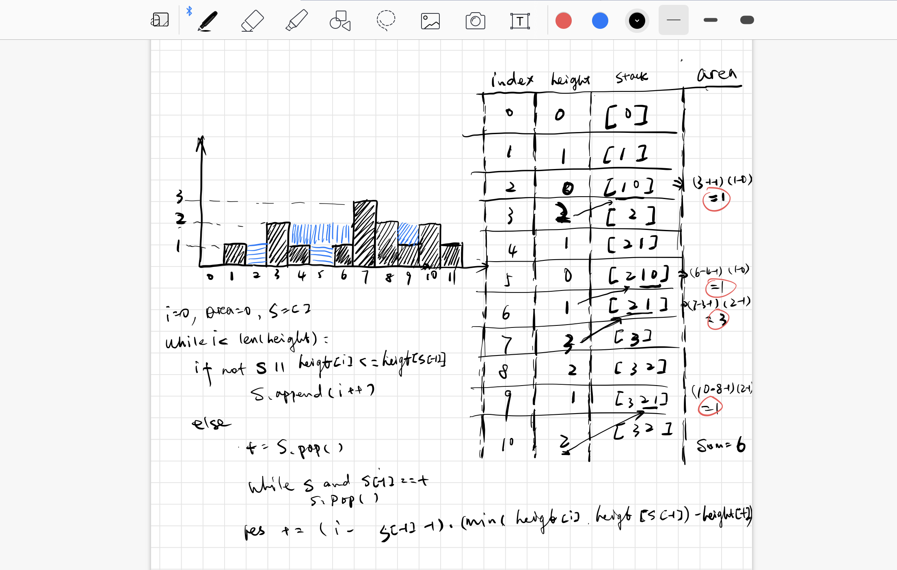

## 思路
- 维护一个单调递减栈，每当新的高度小于等于栈顶高度，则把当前高度的坐标压入栈。
- 注意我们不直接把高度压入栈，而是把坐标压入栈，这样方便我们在后来算水平距离。
- 当我们遇到比栈顶高度大的时候，就说明有可能会有坑存在，可以装雨水。此时我们栈里至少有一个高度，如果只有一个的话，那么不能形成坑，我们直接跳过。
- 如果多余一个或多个的话，那么此时把栈顶元素取出来当作坑，记录栈顶元素的高度t。不断弹出栈顶元素直到栈顶元素不等于坑的高度。
- **此时栈顶元素是左边界**，当前高度是右边界，只要取二者较小的，减去坑的高度，长度就是右边界坐标减去左边界坐标再减1，二者相乘就是盛水量。
- 注意不要弹出左边界，一下次该左边界可能成为坑的高度。

