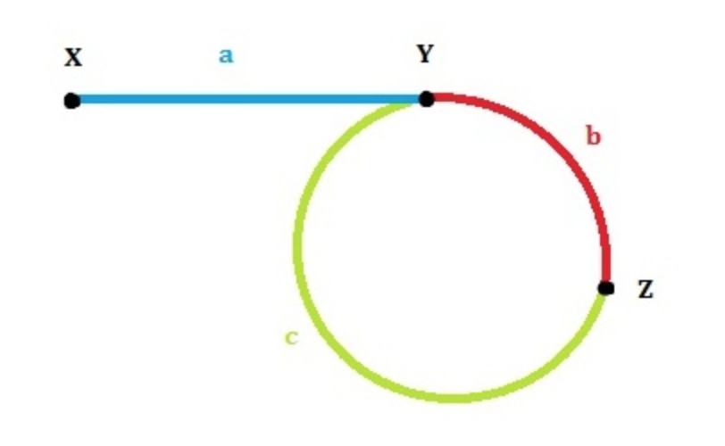

## 思路

 

1. 第一次相遇时slow走过的距离：a+b，fast走过的距离：a+b+c+b。

2. 因为fast的速度是slow的两倍，所以fast走的距离是slow的两倍，有 2(a+b) = a+b+c+b，可以得到a=c（这个结论很重要！）。

3. 我们发现L=b+c=a+b，也就是说，从一开始到二者第一次相遇，循环的次数就等于环的长度。

4. 我们已经得到了结论a=c，那么让两个指针分别从X和Z开始走，每次走一步，那么正好会在Y相遇！也就是环的第一个节点。