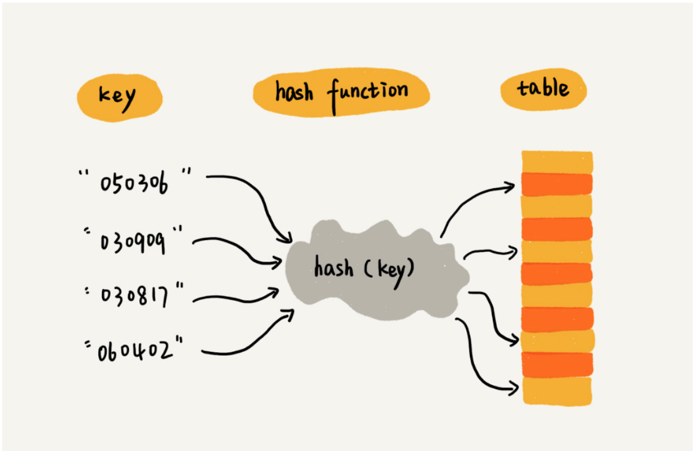
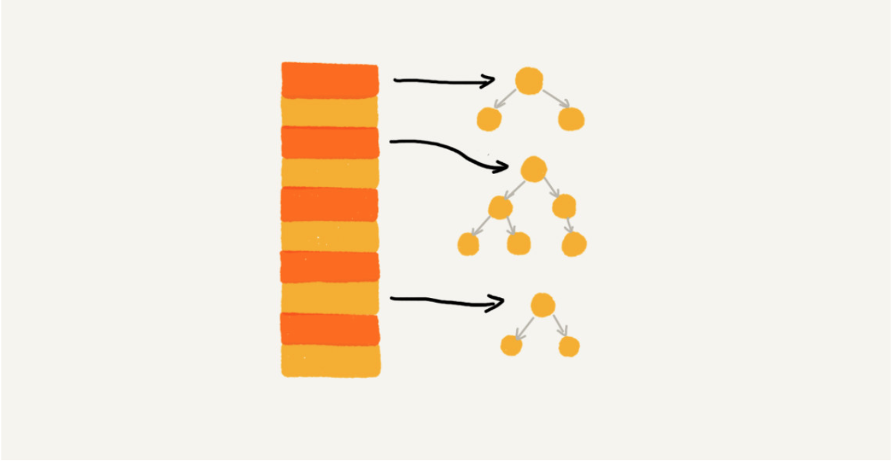
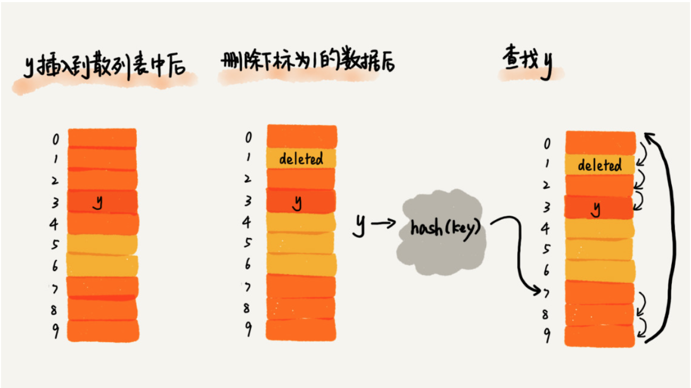
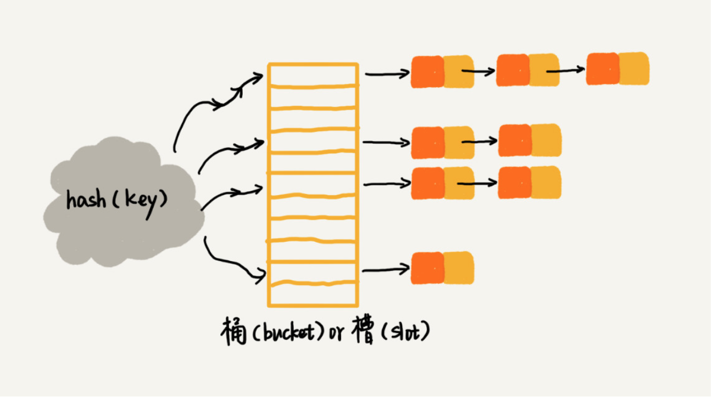

## 散列思想
**散列表用的是数组支持按照下标随机访问数据的特性，所以散列表其实就是数组的一种扩展，由数组演化而来。**

我们把**key**转化为数组下标的映射方法就叫作**散列函数**，而散列函数计算得到的值就叫作**散列值**。

我们可以总结出这样的规律：散列表用的就是数组支持按照下标随机访问的时候，时间复杂度是 O(1) 的特性。我们通过散列函数把元素的键值映射为下标，然后将数据存储在数组中对应下标的位置。当我们按照键值查询元素时，我们用同样的散列函数，将键值转化数组下标，从对应的数组下标的位置取数据。**注意，key对应的数组下标存储的元素不仅仅是value，还可能有 key，比如线性探查法中，为了解决哈希冲突，就会存储[key,value] pairs.**



### 散列函数
设计散列函数的基本要求：

- 散列函数计算得到的散列值是一个非负整数；
- 如果 key1 = key2，那 hash(key1) == hash(key2)；
- 如果 key1 != key2，那 hash(key1) != hash(key2)；
- 散列函数的设计不能太复杂。过于复杂的散列函数，势必会消耗很多计算时间，也就间接的影响到散列表的性能；
- 散列函数生成的值要尽可能随机并且均匀分布，这样才能避免或者最小化散列冲突


### 冲突解决方法
两种主要的散列冲突的解决办法，开放寻址法和链表法。这两种冲突解决办法在实际的软件开发中都非常常用。比如，Java 中 LinkedHashMap 就采用了链表法解决冲突，ThreadLocalMap 是通过线性探测的开放寻址法来解决冲突。

#### 开放寻址法

1. 开放寻址法的优点。

开放寻址法不像链表法，需要拉很多链表。散列表中的数据都存储在数组中，可以有效地利用 CPU 缓存加快查询速度。而且，这种方法实现的散列表，序列化起来比较简单。链表法包含指针，序列化起来就没那么容易。你可不要小看序列化，很多场合都会用到的。我们后面就有一节会讲什么是数据结构序列化、如何序列化，以及为什么要序列化。

2. 开放寻址法有哪些缺点。

用开放寻址法解决冲突的散列表，删除数据的时候比较麻烦，需要特殊标记已经删除掉的数据。而且，在开放寻址法中，所有的数据都存储在一个数组中，比起链表法来说，冲突的代价更高。所以，使用开放寻址法解决冲突的散列表，装载因子的上限不能太大。这也导致这种方法比链表法更浪费内存空间。

所以，**当数据量比较小、装载因子小的时候，适合采用开放寻址法**。这也是 Java 中的ThreadLocalMap使用开放寻址法解决散列冲突的原因。

#### 链表法

首先，链表法对内存的利用率比开放寻址法要高。因为链表结点可以在需要的时候再创建，并不需要像开放寻址法那样事先申请好。实际上，这一点也是我们前面讲过的链表优于数组的地方。

链表法比起开放寻址法，对大装载因子的容忍度更高。开放寻址法只能适用装载因子小于 1 的情况。接近 1 时，就可能会有大量的散列冲突，导致大量的探测、再散列等，性能会下降很多。但是对于链表法来说，只要散列函数的值随机均匀，即便装载因子变成 10，也就是链表的长度变长了而已，虽然查找效率有所下降，但是比起顺序查找还是快很多。

还记得我们之前在链表那一节讲的吗？链表因为要存储指针，所以对于比较小的对象的存储，是比较消耗内存的，还有可能会让内存的消耗翻倍。而且，因为链表中的结点是零散分布在内存中的，不是连续的，所以对 CPU 缓存是不友好的，这方面对于执行效率也有一定的影响。

当然，如果我们存储的是大对象，也就是说要存储的对象的大小远远大于一个指针的大小（4 个字节或者 8 个字节），那链表中指针的内存消耗在大对象面前就可以忽略了。

实际上，我们对链表法稍加改造，可以实现一个更加高效的散列表。那就是，**我们将链表法中的链表改造为其他高效的动态数据结构，比如跳表、红黑树。这样，即便出现散列冲突，极端情况下，所有的数据都散列到同一个桶内，那最终退化成的散列表的查找时间也只不过是 O(logn)**。这样也就有效避免了前面讲到的散列碰撞攻击。



## 问题

[706. Design HashMap](https://leetcode.com/problems/design-hashmap/)

Design a HashMap without using any built-in hash table libraries.
To be specific, your design should include these functions:

- put(key, value) : Insert a (key, value) pair into the HashMap. If the value already exists in the HashMap, update the value.
- get(key): Returns the value to which the specified key is mapped, or -1 if this map contains no mapping for the key.
- remove(key) : Remove the mapping for the value key if this map contains the mapping for the key.

Note
- All keys and values will be in the range of [0, 1000000].
- The number of operations will be in the range of [1, 10000].
- Please do not use the built-in HashMap library.


### 直接寻址

直接将key作为index,实际上是使用了输入与输出完全一致的 hash function.
```python
def hash(key):
    return key
```
2. 使用完全一致的hash function 可能会造成大量空间的浪费。因为存储空间必须大于key的range。 

```python
class MyHashMap:

    def __init__(self):
        """
        Initialize your data structure here.
        """
        self.table = [-1] * 1000000
        

    def put(self, key: int, value: int) -> None:
        """
        value will always be non-negative.
        """
        self.table[key] = value
        

    def get(self, key: int) -> int:
        """
        Returns the value to which the specified key is mapped, or -1 if this map contains no mapping for the key
        """
        return self.table[key]
        

    def remove(self, key: int) -> None:
        """
        Removes the mapping of the specified value key if this map contains a mapping for the key
        """
        self.table[key] = -1
        


# Your MyHashMap object will be instantiated and called as such:
# obj = MyHashMap()
# obj.put(key,value)
# param_2 = obj.get(key)
# obj.remove(key)
```


## 线性探查法（开放寻址法）

开放寻址法的核心思想是，如果出现了散列冲突，我们就重新探测一个空闲位置，将其插入。那如何重新探测新的位置呢？

### 线性探测（Linear Probing）。

当我们往散列表中插入数据时，如果某个数据经过散列函数散列之后，存储位置已经被占用了，我们就从当前位置开始，依次往后查找，看是否有空闲位置，直到找到为止。

1. 查询元素:SEARCH(k)

从 hash address 开始依次往后寻找，直到**第一个为空**的位置。如果到了空位置任然没有找到元素，说明元素不在 table 中。**这里需要特别注意(debug 了几个小时妈的)**，因为table里可能会删除元素，所以找到空位置后其实后面还可能存在元素。这里有几种解决方案。
- 每次查询都遍历整个表，时间复杂度高，leetocde 不能通过。
- 每次删除元素不真正删除元素，而是在删除位置添加**delete**标记(具体添加标记的方式自己定义)，那么查询时就可以遍历到**第一个为空**的位置而停止了（标记为**delete**的位置不为空）。



2. 删除元素:DELETE(ele)

删除元素时，不能完全删除元素，需要在删除的位置标记为"deleted"。

3. 插入元素:INSERT(ele)

插入元素时，
- 表中不存在该key，需要找到第一个标记为**空**或者标记为**delete**的位置。
- 表中存在key，找到该key，更新value。


```python
class MyHashMap:

    def __init__(self):
        """
        Initialize your data structure here.
        """
        self.table = [None] * 10000
        self.capacity = 10000
    
    def hash_address(self,key):
        return key % self.capacity

    def put(self, key: int, value: int) -> None:
        """
        value will always be non-negative.
        """
        index = self.hash_address(key)
        ## 遍历到第一个为“delete” 或者为空的位置
        while self.table[index] and self.table[index][0] != -1 and self.table[index][0] != key:
            index = (index + 1) % self.capacity
        self.table[index] = [key,value]
        
        

    def get(self, key: int) -> int:
        """
        Returns the value to which the specified key is mapped, or -1 if this map contains no mapping for the key
        """
        index = self.hash_address(key)
        ## 遍历到第一个为空的位置
        while self.table[index]:
            if self.table[index][0] == key:
                return self.table[index][1]
            index = (index + 1) % self.capacity
        
        return -1
        

    def remove(self, key: int) -> None:
        """
        Removes the mapping of the specified value key if this map contains a mapping for the key
        """
        index = self.hash_address(key)
        while self.table[index]:
            if self.table[index][0] == key:
                ## 删除元素时，只是把 key 置为-1，相当于标记 delete
                self.table[index][0] = -1
            index = (index + 1) % self.capacity
        


# Your MyHashMap object will be instantiated and called as such:
# obj = MyHashMap()
# obj.put(key,value)
# param_2 = obj.get(key)
# obj.remove(key)
```

线性探测法其实存在很大问题。当散列表中插入的数据越来越多时，散列冲突发生的可能性就会越来越大，空闲位置会越来越少，线性探测的时间就会越来越久。极端情况下，我们可能需要探测整个散列表，所以最坏情况下的时间复杂度为 O(n)。同理，在删除和查找时，也有可能会线性探测整张散列表，才能找到要查找或者删除的数据。

对于开放寻址冲突解决方法，除了线性探测方法之外，还有另外两种比较经典的探测方法，二次探测（Quadratic probing）和双重散列（Double hashing）。

### 二次探测
所谓二次探测，跟线性探测很像，线性探测每次探测的步长是 1，那它探测的下标序列就是 hash(key)+0，hash(key)+1，hash(key)+2……而二次探测探测的步长就变成了原来的“二次方”，也就是说，它探测的下标序列就是 hash(key)+0，hash(key)+12，hash(key)+22……

### 双重散列
所谓双重散列，意思就是不仅要使用一个散列函数。我们使用一组散列函数 hash1(key)，hash2(key)，hash3(key)……我们先用第一个散列函数，如果计算得到的存储位置已经被占用，再用第二个散列函数，依次类推，直到找到空闲的存储位置。

### 装载因子

不管采用哪种探测方法，当散列表中空闲位置不多的时候，散列冲突的概率就会大大提高。为了尽可能保证散列表的操作效率，一般情况下，我们会尽可能保证散列表中有一定比例的空闲槽位。我们用装载因子（load factor）来表示空位的多少。

装载因子的计算公式是：

> 散列表的装载因子 = 填入表中的元素个数 / 散列表的长度

装载因子越大，说明空闲位置越少，冲突越多，散列表的性能会下降。


##  链表法

链表法是一种更加常用的散列冲突解决办法，相比开放寻址法，它要简单很多。我们来看这个图，在散列表中，每个“桶（bucket）”或者“槽（slot）”会对应一条链表，所有散列值相同的元素我们都放到相同槽位对应的链表中。

当插入的时候，我们只需要通过散列函数计算出对应的散列槽位，将其插入到对应链表中即可，所以插入的时间复杂度是 O(1)。当查找、删除一个元素时，我们同样通过散列函数计算出对应的槽，然后遍历链表查找或者删除。那查找或删除操作的时间复杂度是多少呢？

实际上，这两个操作的时间复杂度跟链表的长度 k 成正比，也就是 O(k)。对于散列比较均匀的散列函数来说，理论上讲，k=n/m，其中 n 表示散列中数据的个数，m 表示散列表中“槽”的个数。

```python
class MyHashMap:

    def __init__(self):
        """
        Initialize your data structure here.
        """
        self.buckets = 1000                       # 键值块，哈希桶
        self.itemsPerBuckect = 1001               # 产生冲突的“拉链”块
        self.hashmap = [[] for _ in range(self.buckets)]        # _表示临时变量，仅用一次，后面无需用到
    
    
    
    # 散列函数
    def hash(self, key):
        return key % self.buckets                 # 取buckets的index

    # 处理冲突的函数 (ucket 相同，计算key在bucket里不同的位置)
    def pos(self, key):
        return key // self.buckets                # 向下取整，返回商的整数部分
    
    

    def put(self, key, value):
        """
        value will always be non-negative.
        :type key: int
        :type value: int
        :rtype: void
        """
        hashkey = self.hash(key)
        if not self.hashmap[hashkey]:                
            self.hashmap[hashkey] = [None] * self.itemsPerBuckect
        self.hashmap[hashkey][self.pos(key)] = value
        
        

    def get(self, key):
        """
        Returns the value to which the specified key is mapped, or -1 if this map contains no mapping for the key
        :type key: int
        :rtype: int
        """
        hashkey = self.hash(key)
        if(not self.hashmap[hashkey]) or self.hashmap[hashkey][self.pos(key)] == None:      # 没有找到这个值
            return -1
        else:
            return self.hashmap[hashkey][self.pos(key)]
        

    def remove(self, key):
        """
        Removes the mapping of the specified value key if this map contains a mapping for the key
        :type key: int
        :rtype: void
        """
        hashkey = self.hash(key)
        if self.hashmap[hashkey]:
            self.hashmap[hashkey][self.pos(key)] = None
        

# Your MyHashMap object will be instantiated and called as such:
# obj = MyHashMap()
# obj.put(key,value)
# param_2 = obj.get(key)
# obj.remove(key)
```


## 工业级散列表举例分析
刚刚我讲了实现一个工业级散列表需要涉及的一些关键技术，现在，我就拿一个具体的例子，Java 中的 HashMap 这样一个工业级的散列表，来具体看下，这些技术是怎么应用的。

1. 初始大小

HashMap 默认的初始大小是 16，当然这个默认值是可以设置的，如果事先知道大概的数据量有多大，可以通过修改默认初始大小，减少动态扩容的次数，这样会大大提高 HashMap 的性能。

2. 装载因子和动态扩容

最大装载因子默认是 0.75，当 HashMap 中元素个数超过 0.75\*capacity（capacity 表示散列表的容量）的时候，就会启动扩容，每次扩容都会扩容为原来的两倍大小。

3. 散列冲突解决方法

HashMap 底层采用链表法来解决冲突。即使负载因子和散列函数设计得再合理，也免不了会出现拉链过长的情况，一旦出现拉链过长，则会严重影响 HashMap 的性能。

于是，在 JDK1.8 版本中，为了对 HashMap 做进一步优化，我们引入了红黑树。而当链表长度太长（默认超过 8）时，链表就转换为红黑树。我们可以利用红黑树快速增删改查的特点，提高 HashMap 的性能。当红黑树结点个数少于 8 个的时候，又会将红黑树转化为链表。因为在数据量较小的情况下，红黑树要维护平衡，比起链表来，性能上的优势并不明显。

4. 散列函数

散列函数的设计并不复杂，追求的是简单高效、分布均匀。我把它摘抄出来，你可以看看。
```java
int hash(Object key) {
  int h = key.hashCode()；
  return (h ^ (h >>> 16)) & (capitity -1); //capicity 表示散列表的大小
}
```
其中，hashCode() 返回的是 Java 对象的 hash code。比如 String 类型的对象的 hashCode() 就是下面这样：
```java
public int hashCode() {
  int var1 = this.hash;
  if(var1 == 0 && this.value.length > 0) {
    char[] var2 = this.value;
    for(int var3 = 0; var3 < this.value.length; ++var3) {
      var1 = 31 * var1 + var2[var3];
    }
    this.hash = var1;
  }
  return var1;
}
```


> reference 数据结构与算法之美 王争