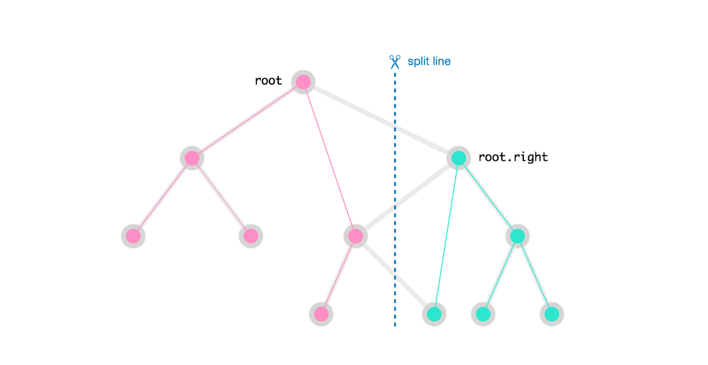

Intuition and Algorithm

The root node either belongs to the first half or the second half. Let's say it belongs to the first half.

Then, because the given tree is a binary search tree (BST), the entire subtree at root.left must be in the first half. However, the subtree at root.right may have nodes in either halves, so it needs to be split.

In the diagram above, the thick lines represent the main child relationships between the nodes, while the thinner colored lines represent the subtrees after the split.

Lets say our secondary answer bns = split(root.right) is the result of such a split. Recall that bns[0] and bns[1] will both be BSTs on either side of the split. The left half of bns must be in the first half, and it must be to the right of root for the first half to remain a BST. The right half of bns is the right half in the final answer.

通过观察我们首先发现，无论如何，root总是会包含在最终的返回结果中。然后就比较root的值和V的大小了：如果root的值比V大，那么root以及其右子树的结构都无需变化，只需要递归对root的左子树进行分割即可。需要注意的是，root的左子树中也有可能存在比V大的分支，所以我们需要将root的左子树中比V大的分支的树根接到root的左子树上。进一步分析可知，对root的左子树进行分割的思路和对root的分割完全一样，所以我们就可以采用递归调用进行处理了.

