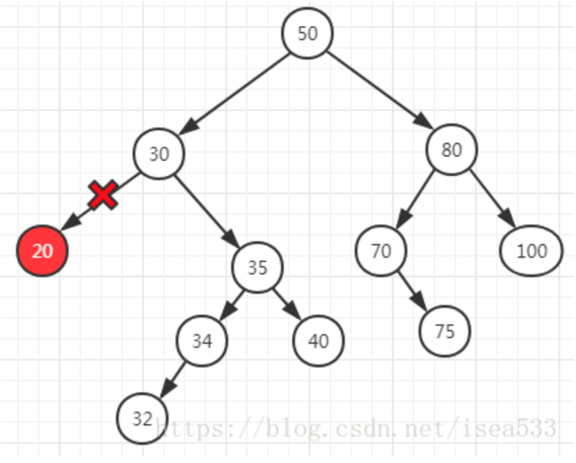
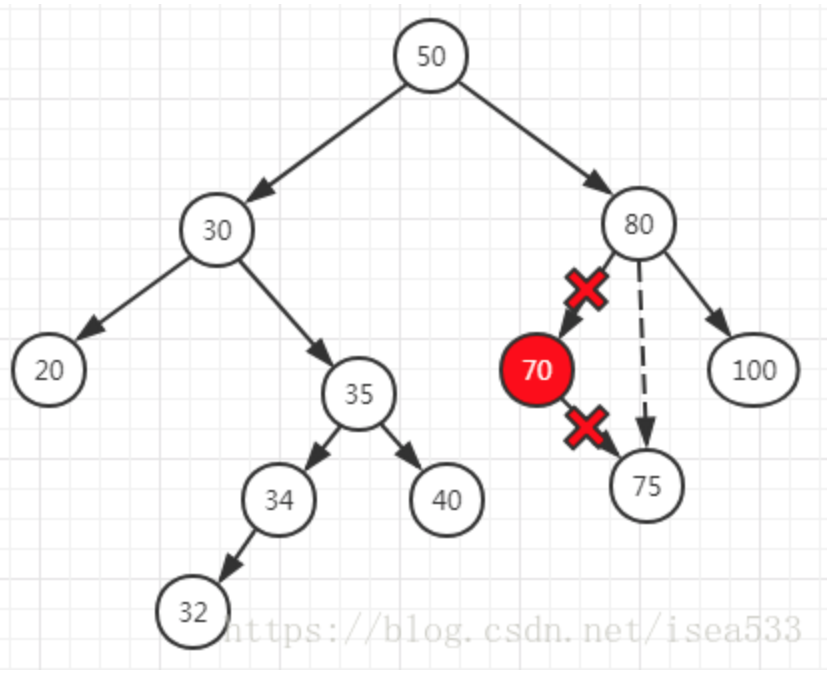
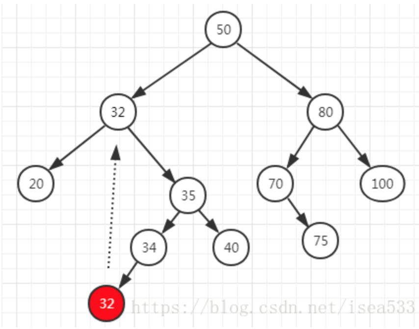

## Definition
是一棵二叉树，其结点的值总是大于其左子树中任意结点的值而小于右子树中任意结点的值

### 查找操作
当二叉查找树不为空时：

1. 首先将给定值与根结点的关键字比较，若相等，则查找成功
2. 若小于根结点的关键字值，递归查左子树
3. 若大于根结点的关键字值，递归查右子树
4. 若子树为空，查找不成功


```Python
def find(self,x,node):
    if not node:
        return None
    elif x == node.key:
        return node
    elif x < node.key:
        return self.find(x,node.left)
    else:
        return self.find(x,node.right)

```


### 插入操作
二叉排序树是一种动态树表。其特点是：树的结构通常不是一次生成的，而是在查找过程中，当树中不存在关键字等于给定值的结点时再进行插入。新插入的结点一定是一个新添加的叶子结点，并且是查找不成功时查找路径上访问的最后一个结点的左孩子或右孩子结点

```Python
def insert(self,x):

        flag,node,parent = self.find_parent(self.root,self.root,x)
        if not flag:
            if x < parent.key:
                parent.left = Node(x)
            elif x > parent.key:
                parent.right = Node(x)    
```

### 寻找父节点
```Python
 def find_parent(self,node,parent,x):
    if node is None:
        return False,node,parent
    if node.key == x:
        return True,node,parent
    if node.key > x:
        return self.find_parent(node.left, node, x)
    else:
        return self.find_parent(node.right, node, x)
```


### 寻找最大或最小
```Python
def find_max(self,node):
    if not node.right:
        return node
    else:
        return self.find_max(node.right)

def find_min(self,node):
    if not node.left:
        return node
    else:
        return self.find_min(node.left)
```

### 删除操作 

**若要删除一个BST的一个结点，需要考虑如下三种情况：**
1. 需要删除的节点下并没有其他子节点
2. 需要删除的节点下有一个子节点（左或右）
3. 需要删除的节点下有两个子节点（既左右节点都存在）

**对这三种情况分别采取的措施是：**

1. 直接删除此结点

2. 删除此结点，将此结点父节点连接到此结点左（右）子树

3. 找出此结点右子树中的最小结点，用以代替要删除的结点，然后删除此最小结点（删除最小结点又称为上述前两种情况）

```Python
def delete(self,x):
    flag,node,parent = self.find_parent(self.root,self.root,x)
    if not flag:
        return 
    else:
        if not node.left and not node.right:
            if node == parent.left:
                parent.left = None
            else:
                parent.right = None    
            del node
        elif not node.left and node.right:
            if node == parent.left:
                parent.left = node.right
            else:
                parent.right = node.right  
            del node     
        elif not node.right and node.left:
            if node == parent.left:
                parent.left = node.left
            else:
                parent.right = node.left
            del node
        else:
            right_min = self.find_min(node.right)    
            tmp = right_min.key
            self.delete(tmp)
            node.key = tmp
```