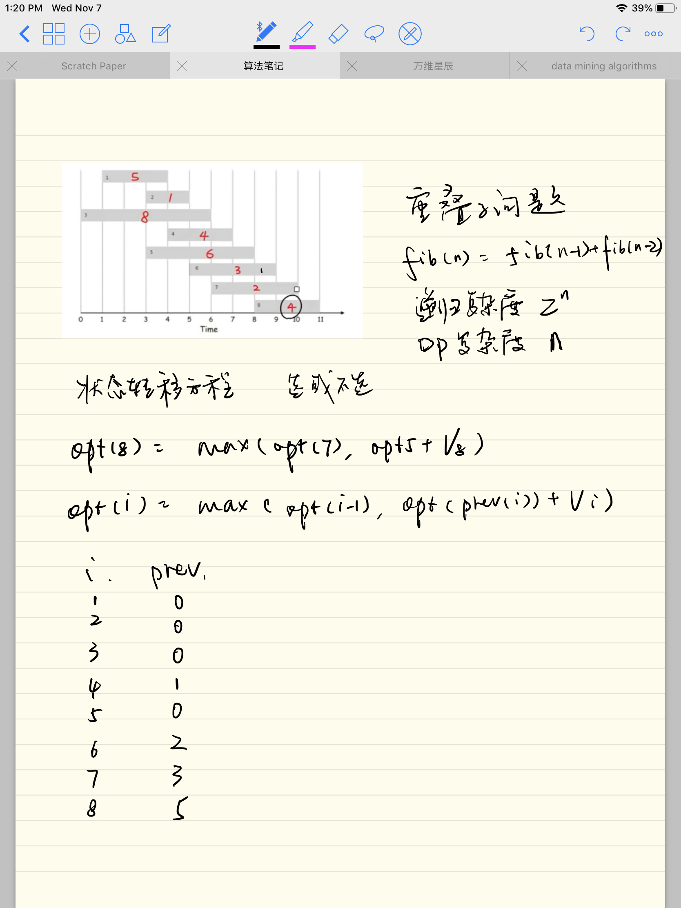

## 动态规划

### 核心
> **Those who can not remember the past are condemned to repeat it**

### 最优子结构
**用动态规划求解最优化问题的第一步就是刻画最优解的结构，如果一个问题的解结构包含其子问题的最优解，就称此问题具有最优子结构性质。因此，某个问题是否适合应用动态规划算法，它是否具有最优子结构性质是一个很好的线索。使用动态规划算法时，用子问题的最优解来构造原问题的最优解。因此必须考查最优解中用到的所有子问题。**

### 重叠子问题
**在斐波拉契数列和钢条切割结构图中，可以看到大量的重叠子问题，比如说在求fib（6）的时候，fib（2）被调用了5次，在求cut（4）的时候cut（0）被调用了4次。如果使用递归算法的时候会反复的求解相同的子问题，不停的调用函数，而不是生成新的子问题。如果递归算法反复求解相同的子问题，就称为具有重叠子问题（overlapping subproblems）性质。在动态规划算法中使用数组来保存子问题的解，这样子问题多次求解的时候可以直接查表不用调用函数递归。**


### fibonacci 的dp解法
```Python
## 自顶向下备忘录
def fibonacci(n):
    memo = {}

    def fib(n,memo):
        if n in memo:
            return memo[n]
        if n <= 2:
            memo[n] = 1
        else:
            memo[n] = fib(n-1, memo) + fib(n-2,memo)
        return memo[n]

    print(fib(n,memo))

fibonacci(10)


## 自底向上备忘录
def fibonacci2(n):
    memo = [1,1]
    if n < 2:
        return memo[n]

    for i in range(2,n):
        memo.append(memo[i-1] + memo[i-2])

    print(memo[-1])    
    return memo[-1]

fibonacci2(10)


```

### 活动选择问题

```Python
def get_max_paid():
    prev_table = {
    1:0,
    2:0,
    3:0,
    4:1,
    5:0,
    6:2,
    7:3,
    8:5
}
    price = [0,5,1,8,4,6,3,2,4]
    dp = [0]

    for i in range(1,9):
        dp.append(max(dp[i-1],dp[prev_table[i]] + price[i]))
    print(dp)
    return dp[-1]

print(get_max_paid())
```


国王挖矿问题

- 子问题:
    国王需要根据两个大臣的答案以及第9座金矿的信息才能判断出最多能够开采出多少金子。为了解决自己面临的问题，他需要给别人制造另外两个问题，这两个问题就是子问题。

- 最优子结构:
    国王相信，只要他的两个大臣能够回答出正确的答案（对于考虑能够开采出的金子数，最多的也就是最优的同时也就是正确的），再加上他的聪明的判断就一定能得到最终的正确答案。**我们把这种子问题最优时母问题通过优化选择后一定最优的情况叫做“最优子结构”。**

- 子问题重叠:
    实际上国王也好，大臣也好，所有人面对的都是同样的问题，即给你一定数量的人，给你一定数量的金矿，让你求出能够开采出来的最多金子数。我们把这种母问题与子问题本质上是同一个问题的情况称为“子问题重叠”。然而问题中出现的不同点往往就是被子问题之间传递的参数，比如这里的人数和金矿数。

- 边界:
    想想如果不存在前面我们提到的那些底层劳动者的话这个问题能解决吗？永远都不可能！我们把这种子问题在一定时候就不再需要提出子子问题的情况叫做边界，没有边界就会出现死循环。

- 子问题独立:
    要知道，当国王的两个大臣在思考他们自己的问题时他们是不会关心对方是如何计算怎样开采金矿的，因为他们知道，国王只会选择两个人中的一个作为最后方案，另一个人的方案并不会得到实施，因此一个人的决定对另一个人的决定是没有影响的。我们把这种一个母问题在对子问题选择时，当前被选择的子问题两两互不影响的情况叫做“子问题独立”。

>  这就是动态规划，具有“最优子结构”、“子问题重叠”、“边界”和“子问题独立”，当你发现你正在思考的问题具备这四个性质的话，那么恭喜你，你基本上已经找到了动态规划的方法。

- 做备忘录:
    正如上面所说的一样，当我们遇到相同的问题时，我们可以问同一个人。讲的通俗一点就是，我们可以把问题的解放在一个变量中，如果再次遇到这个问题就直接从变量中获得答案，因此每一个问题仅会计算一遍，如果不做备忘的话，动态规划就没有任何优势可言了。       

- 时间分析:
    正如上面所说，如果我们用穷举的方法，至少需要2^n个常数时间，因为总共有2^n种情况需要考虑，如果在背包问题中，包的容量为1000，物品数为100，那么需要考虑2^100种情况,这个数大约为10的30次方。


## 动态规划求解步骤:

1. 构造问题所对应的过程。

2. 思考过程的最后一个步骤，看看有哪些选择情况。

3. 找到最后一步的子问题，确保符合“子问题重叠”，把子问题中不相同的地方设置为参数。

4. 使得子问题符合“最优子结构”。

5. 找到边界，考虑边界的各种处理方式。

6. 确保满足“子问题独立”，一般而言，如果我们是在多个子问题中选择一个作为实施方案，而不会同时实施多个方案，那么子问题就是独立的。

7. 考虑如何做备忘录。

8. 分析所需时间是否满足要求。

9. 写出转移方程式。


## 例子
题目一：买书

有一书店引进了一套书，共有3卷，每卷书定价是60元，书店为了搞促销，推出一个活动，活动如下：


- 如果单独购买其中一卷，那么可以打9.5折。

- 如果同时购买两卷不同的，那么可以打9折。

- 如果同时购买三卷不同的，那么可以打8.5折。

如果小明希望购买第1卷x本，第2卷y本，第3卷z本，那么至少需要多少钱呢？（x、y、z为三个已知整数）。


答案：

1. 过程为一次一次的购买，每一次购买也许只买一本（这有三种方案），或者买两本（这也有三种方案），或者三本一起买（这有一种方案），最后直到买完所有需要的书。
2. 最后一步我必然会在7种购买方案中选择一种，因此我要在7种购买方案中选择一个最佳情况。
3. 子问题是，我选择了某个方案后，如何使得购买剩余的书能用最少的钱？并且这个选择不会使得剩余的书为负数。母问题和子问题都是给定三卷书的购买量，求最少需要用的钱，所以有“子问题重叠”，问题中三个购买量设置为参数，分别为i、j、k。
4. 的确符合。
5. 边界是一次购买就可以买完所有的书，处理方式请读者自己考虑。
6. 每次选择最多有7种方案，并且不会同时实施其中多种，因此方案的选择互不影响，所以有“子问题独立”。
7. 我可以用minMoney[i][j][k]来保存购买第1卷i本，第2卷j本，第3卷k本时所需的最少金钱。
8. 共有x * y * z 个问题，每个问题面对7种选择，时间为：O( x * y * z * 7) =  O( x * y * z )。
9. 用函数MinMoney(i,j,k)来表示购买第1卷i本，第2卷j本，第3卷k本时所需的最少金钱，那么有：

  MinMoney(i,j,k) = min(s1,s2,s3,s4,s5,s6,s7),
    其中s1,s2,s3,s4,s5,s6,s7分别为对应的7种方案使用的最少金钱：

  s1 = 60 * 0.95 + MinMoney(i-1,j,k)
  s2 = 60 * 0.95 + MinMoney(i,j-1,k)
  s3 = 60 * 0.95 + MinMoney(i,j,k-1)
  s4 = (60 + 60) * 0.9 + MinMoney(i-1,j-1,k)
  s5 = (60 + 60) * 0.9 + MinMoney(i-1,j,k-1)
  s6 = (60 + 60) * 0.9 + MinMoney(i-1,j,k-1)
  s7 = (60 + 60 + 60) * 0.85 + MinMoney(i-1,j-1,k-1)