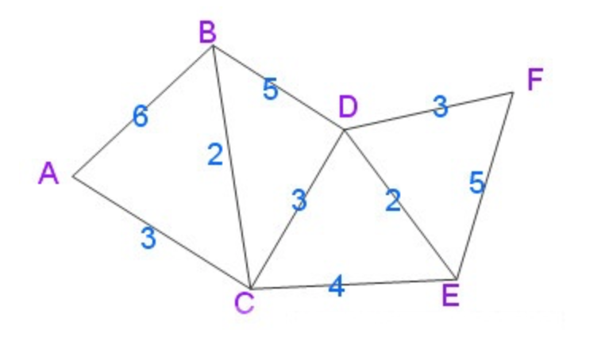
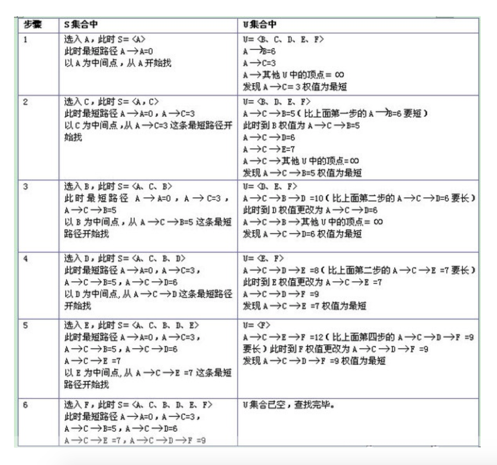

```Python
邻接表矩阵实现
from heapq import *
def dijkstra(graph,start,end):

    q, visited, mins = [(0,start,[])], set(), {start:0}  # q->(cost,start->current,path)
    heapify(q)

    while q:
        (cost,v1,path) = heappop(q)

        if v1 not in visited:
            visited.add(v1)
            path = path + [v1]
 
            if v1 == end: 
                return (cost,path)

            for c,v2 in graph.get(v1,()):
                if v2 in visited: 
                    continue
                prev = mins.get(v2,float("inf"))
                new_path_cost = cost + c
                if prev > new_path_cost:
                    mins[v2] = new_path_cost
                    heappush(q,(new_path_cost,v2,path))
    
    return float("inf")    


if __name__ == '__main__':
    ## 邻接表
    graph = {'A': [(6, 'B'), (3, 'C')], 
             'B': [(6,'A'),(2, 'C'), (5, 'D')], 
             'C': [(3,'A'),(2,'B'),(3, 'D'),(4,'E')], 
             'D': [(5, 'B'),(3, 'C'),(2,'E'),(3,'F')], 
             'E': [(4, 'C'), (2, 'D'),(5,'F')], 
             'F': [(3, 'D'),(5,'E')]
             }
    short_path = dijkstra(graph,'A','F')
    print(short_path)
```

```Python
邻接矩阵实现
from heapq import *


def dijkstra(graph,start,end):

    q, visited, mins = [(0,start,[])], set(), {start:0}  # q->(cost,start->current,path)
    heapify(q)

    while q:
        (cost,v1,path) = heappop(q)

        if v1 not in visited:
            visited.add(v1)
            path = path + [v1]
 
            if v1 == end: 
                return (cost,path)

            for v2,c in enumerate(graph[v1]):
                if v2 in visited or c == float("inf"): 
                    continue
                prev = mins.get(v2,float("inf"))
                new_path_cost = cost + c
                if prev > new_path_cost:
                    mins[v2] = new_path_cost
                    heappush(q,(new_path_cost,v2,path))   
    
    return float("inf")    


if __name__ == '__main__':
    graph = [ [0, 6, 3, float("inf"), float("inf"), float("inf")],
              [6, 0, 2, 5,float("inf"), float("inf")],
              [3, 2, 0, 3,4,float("inf")],
              [float("inf"), 5, 3, 0, 2, 3],
              [float("inf"), float("inf"), 4, 2, 0, 5],
              [float("inf"), float("inf"), float("inf"), 3, 2, float("inf")]]

    path = dijkstra(graph,0,5)  # 查找从源点0开始带其他节点的最短路径
    print(path)
```
