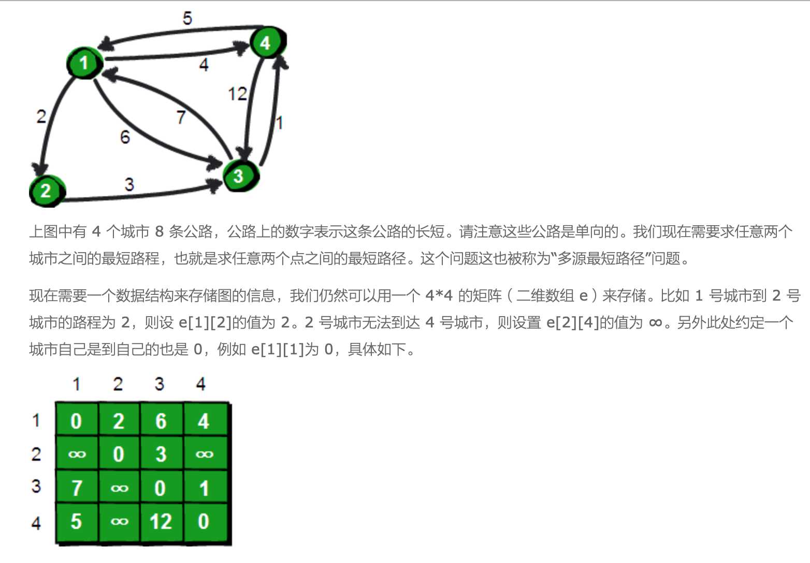
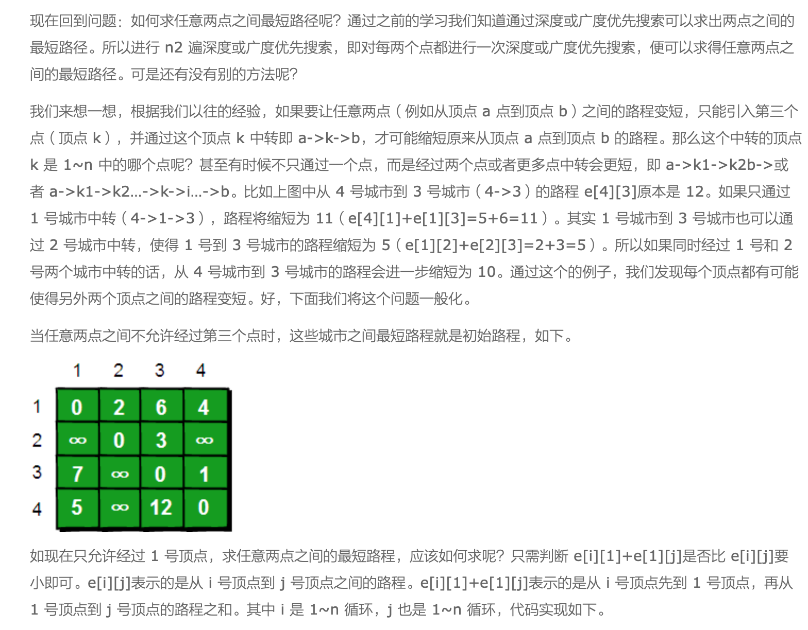
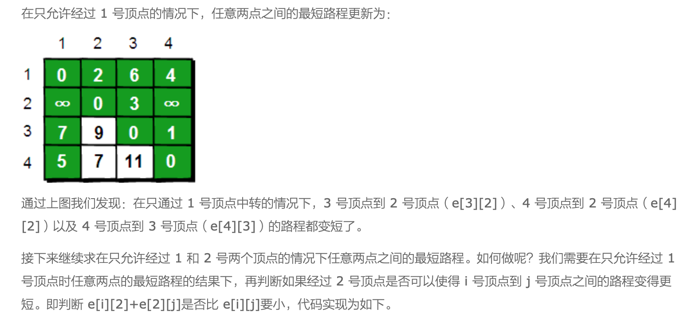
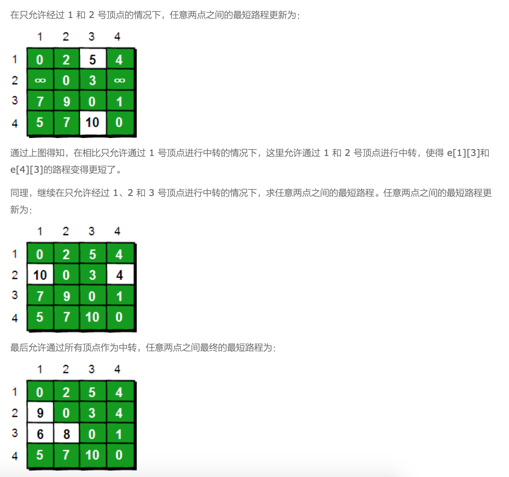

```C
for(i=1;i<=n;i++)
    {
        for(j=1;j<=n;j++)
        {
            if ( e[i][j] > e[i][1]+e[1][j] )
              e[i][j] = e[i][1]+e[1][j];
        }
    }
```


```C
//经过1号顶点
    for(i=1;i<=n;i++)
        for(j=1;j<=n;j++)
            if (e[i][j] > e[i][1]+e[1][j])  e[i][j]=e[i][1]+e[1][j];
    //经过2号顶点
    for(i=1;i<=n;i++)
        for(j=1;j<=n;j++)
            if (e[i][j] > e[i][2]+e[2][j])  e[i][j]=e[i][2]+e[2][j];
```




整个算法过程虽然说起来很麻烦，但是代码实现却非常简单，核心代码只有五行：
```Python
for(k=1;k<=n;k++)
        for(i=1;i<=n;i++)
            for(j=1;j<=n;j++)
                if(e[i][j]>e[i][k]+e[k][j])
                     e[i][j]=e[i][k]+e[k][j]
```

这段代码的基本思想就是：最开始只允许经过 1 号顶点进行中转，接下来只允许经过 1 和 2 号顶点进行中转……允许经过 1~n 号所有顶点进行中转，求任意两点之间的最短路程。


```Python

import copy
Max = float("inf")

def Floyd(G):
    n=len(G)
    path=copy.deepcopy(G)
    for k in range(0,n):
        for i in range(0,n):
            for j in range(0,n):
                path[i][j]=min(path[i][j],path[i][k]+path[k][j])

    return path

if __name__=='__main__':
    Max = float("inf")
    ## 邻接矩阵
    G = [ [0, 6, 3, float("inf"), float("inf"), float("inf")],
              [6, 0, 2, 5,float("inf"), float("inf")],
              [3, 2, 0, 3,4,float("inf")],
              [float("inf"), 5, 3, 0, 2, 3],
              [float("inf"), float("inf"), 4, 2, 0, 5],
              [float("inf"), float("inf"), float("inf"), 3, 2, float("inf")]
            ]

    path=Floyd(G)
    print("Graph = ")
    for i in range(0,len(G)):
        print (path[i])


# ---------------------

def Floyd(G):
    n=len(G)
    path = copy.deepcopy(G)
    for k in range(0,n):
        for i in range(0,n):
            for j in range(0,n):
                path[i][j]= min(path[i].get(j,Max),path[i].get(k,Max) + path[k].get(j,Max))

    return path

if __name__=='__main__':
    
    graph = {0: {1:6, 2:3}, 
             1: {0:6,2:2,3:5},
             2: {0:3,1:2,3:3,4:4},
             3: {1:5,2:3,4:2,5:3}, 
             4: {2:4,3:2,5:5}, 
             5: {3:3,4:5}
    }
    ## 邻接表
    path=Floyd(graph)
    print("Graph = ")
    print(path)
```