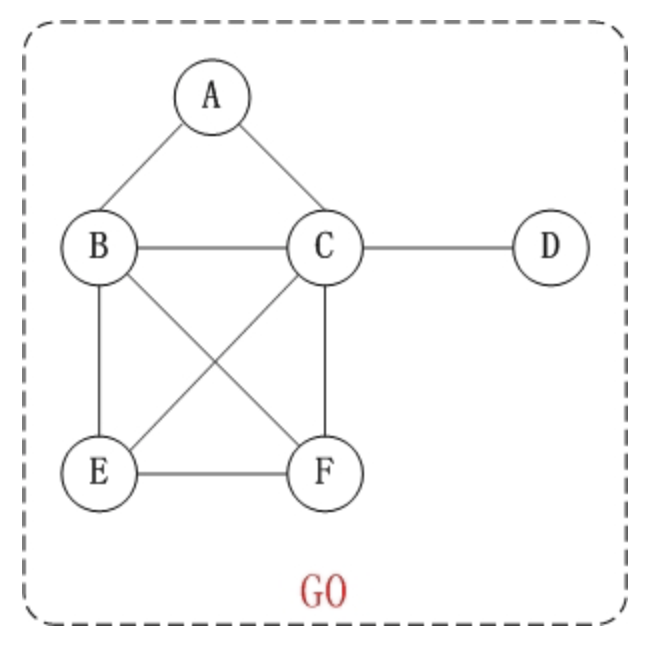
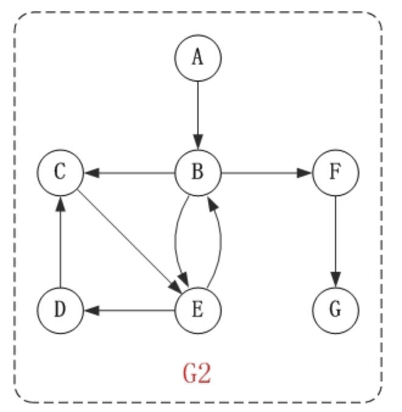
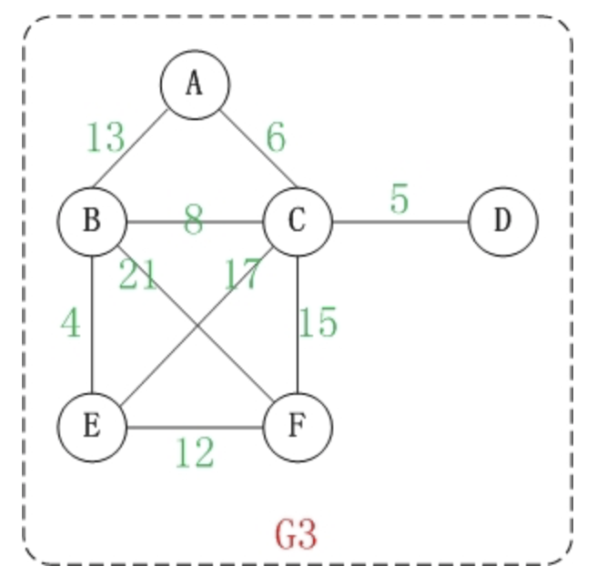
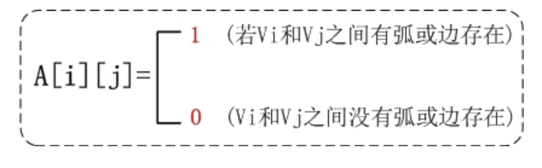
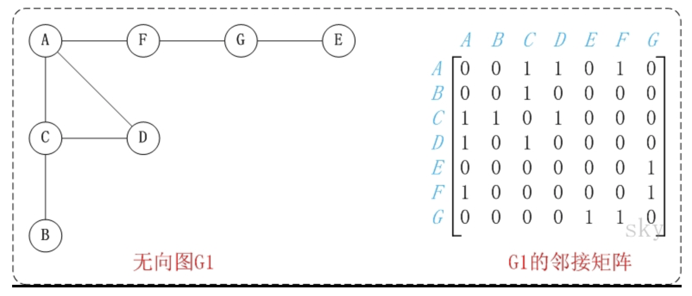
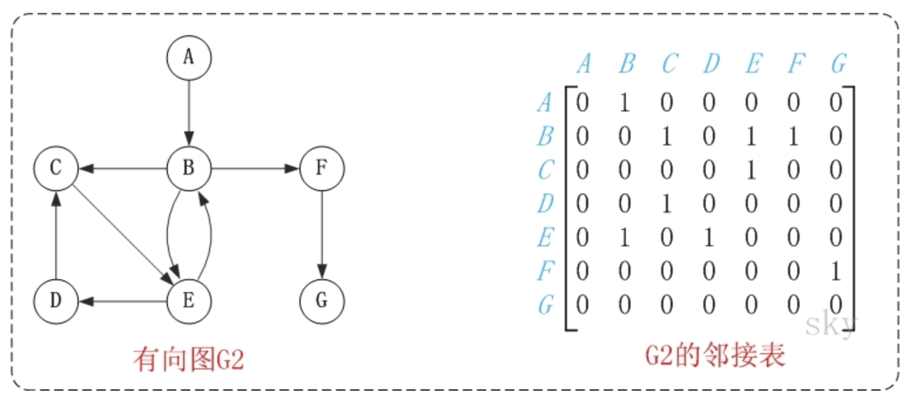
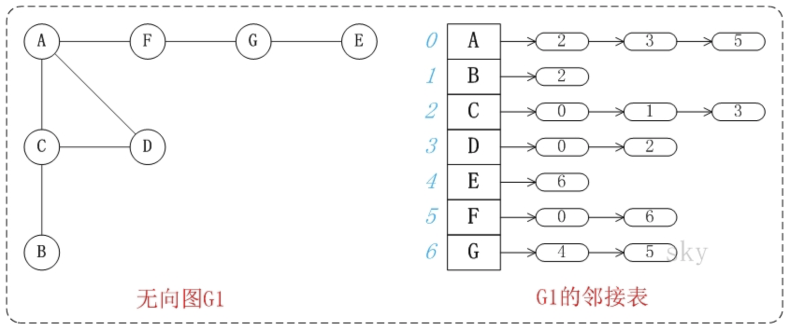
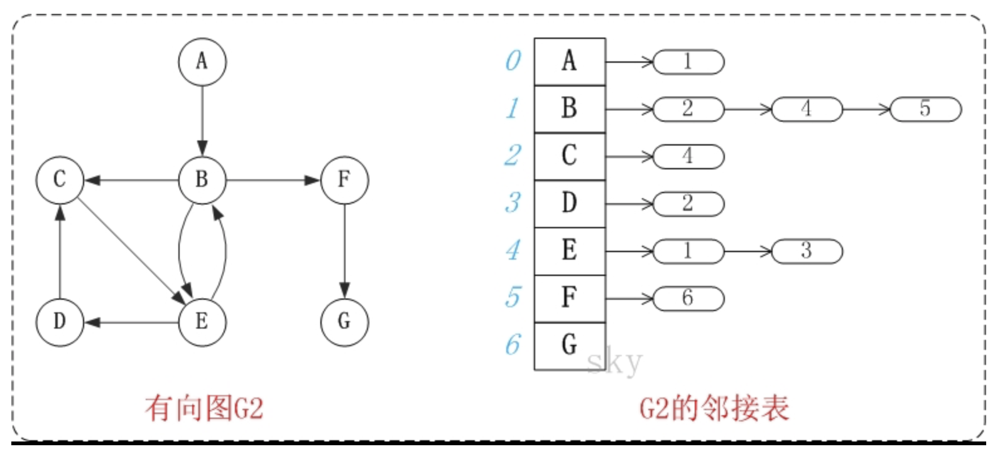
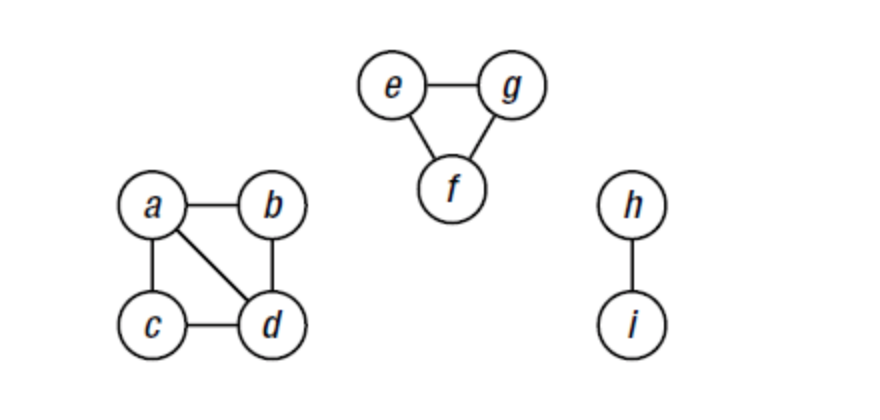
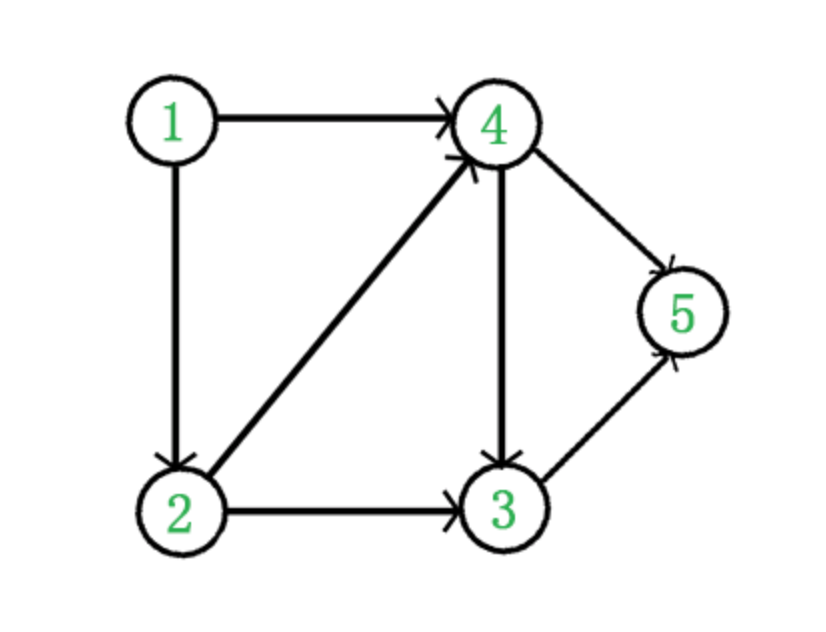

1. 定义
> 图(graph)是由一些点(vertex)和这些点之间的连线(edge)所组成的；其中，点通常被成为"顶点(vertex)"，而点与点之间的连线则被成为"边或弧"(edege)。通常记为，G=(V,E)。

2. 种类
根据边是否有方向，将图可以划分为：无向图和有向图。
    1. 无向图
    
    上面的图G0是无向图，无向图的所有的边都是不区分方向的。G0=(V1,{E1})。其中，
        - V1={A,B,C,D,E,F}。 V1表示由"A,B,C,D,E,F"几个顶点组成的集合。 
        - E1={(A,B),(A,C),(B,C),(B,E),(B,F),(C,F), (C,D),(E,F),(C,E)}。E1是由边(A,B),边(A,C)...等等组成的集合。其中，(A,C)表示由顶点A和顶点C连接成的边。
    2. 有向图
    
    上面的图G2是有向图。和无向图不同，有向图的所有的边都是有方向的！ G2=(V2,{A2})。其中，
        - V2={A,C,B,F,D,E,G}。 V2表示由"A,B,C,D,E,F,G"几个顶点组成的集合。 
        - A2={<A,B>,<B,C>,<B,F>,<B,E>,<C,E>,<E,D>,<D,C>,<E,B>,<F,G>}。E1是由矢量<A,B>,矢量<B,C>...等等组成的集合。其中，矢量<A,B)表示由"顶点A"指向"顶点C"的有向边。

3. 临接点和度
    1. 临接点
    一条边上的两个顶点叫做邻接点。 例如，上面无向图G0中的顶点A和顶点C就是邻接点。在有向图中，除了邻接点之外；还有"入边"和"出边"的概念。 
    
        - 入边，是指以该顶点为终点的边。
        - 出边，则是指以该顶点为起点的边。
        - 例如，上面有向图G2中的B和E是邻接点；<B,E>是B的出边，还是E的入边。

    2. 度
    在无向图中，某个顶点的度是邻接到该顶点的边(或弧)的数目。 例如，上面无向图G0中顶点A的度是2。
    在有向图中，度还有"入度"和"出度"之分。 
        - 入度，是指以该顶点为终点的边的数目。
        - 出度，则是指以该顶点为起点的边的数目。 
        - 顶点的度=入度+出度。 例如，上面有向图G2中，顶点B的入度是2，出度是3；顶点B的度=2+3=5。

4. 路径和回路

    1. 路径：如果顶点(Vm)到顶点(Vn)之间存在一个顶点序列。则表示Vm到Vn是一条路径。 
    2. 路径长度：路径中"边的数量"。 
    3. 简单路径：若一条路径上顶点不重复出现，则是简单路径。 
    4. 回路：若路径的第一个顶点和最后一个顶点相同，则是回路。 
    5. 简单回路：第一个顶点和最后一个顶点相同，其它各顶点都不重复的回路则是简单回路。
    6. 欧拉路径。如果图G中的一个路径包括每个边恰好一次，则该路径称为欧拉路径(Euler path)。
    7. 欧拉回路，欧拉路径首尾相连的情况

5. 连通图和连通分量
    1. 连通图：对无向图而言，任意两个顶点之间都存在一条无向路径，则称该无向图为连通图。
    2. 对有向图而言，若图中任意两个顶点之间都存在一条有向路径，则称该有向图为强连通图。
    3. 连通分量：非连通图中的各个连通子图称为该图的连通分量。

6. 权
    

7. 存储结构
    1.  邻接矩阵
        邻接矩阵是指用矩阵来表示图。它是采用矩阵来描述图中顶点之间的关系(及弧或边的权)。 
        假设图中顶点数为n，则邻接矩阵定义为：
        
        
        
    2. 邻接表
        邻接表是图的一种链式存储表示方法。它是改进后的"邻接矩阵"，它的缺点是不方便判断两个顶点之间是否有边，但是相对邻接矩阵来说更省空间。
        
        
        

## 寻找联通分支

```Python
## 查找联通分量
from collections import deque

def walk(G,num):
    component,queue = {num},deque()
    queue.append(num)

    while queue:
        cur_node = queue.pop()
        for node in G[cur_node].difference(component):
                queue.append(node)
        component |= G[cur_node] # 此时 conponents 中的元素是已经入栈的元素       
          
    return component        


def components(G):
    all_components = dict()
    viasted = set()
    for node in G:

        if not node in viasted:
            component = walk(G,node)
            viasted = viasted.union(component)
            all_components[node] = component

    return all_components


if __name__ == '__main__':
    a, b, c, d, e, f, g, h, i= range(9)
    G = {
        
        a: {b, c, d},   # a
        b: {a, d},      # b
        c: {a,d},       # c
        d: {a,c,d},     # d
        e: {g,f},       # e
        f: {e,g},       # f
        g: {e,f},       # g
        h: {i},         # h
        i: {h}          # i
    }

    comps = components(G)
    print(comps)
```

## 深度优先搜索
### 深度优先搜索 递归
```Python
def rec_dfs(G,u,S=None):
    if not S:
        S = set()
    S.add(u)
    for node in G[u]:
        if node in S:
            continue
        rec_dfs(G,node,S)
```

### 深度优先搜索 迭代
```Python
def iter_dfs(G,s,S):
    stack = []
    stack.append(s)
    while stack:
        u = stack.pop()
        if u in S:
            continue
        S.add(u)
        stack += G[u]    

if __name__ == '__main__':
    a, b, c, d, e, f, g, h, i= range(9)

    G = { a:{b, c, d, e, f},  # a
          b:{c, e},           # b
          c:{d},              # c
          d:{e},              # d
          e:{f},              # e
          f:{c, g, h},        # f
          g:{f, h},           # g
          h:{f, g}            # h
        }
    S = set()    
    iter_dfs(G,a,S)
    print(S)
```

## 拓扑排序

在图论中，拓扑排序（Topological Sorting）是一个有向无环图（DAG, Directed Acyclic Graph）的所有顶点的线性序列。且该序列必须满足下面两个条件：

- 每个顶点出现且只出现一次。
- 若存在一条从顶点 A 到顶点 B 的路径，那么在序列中顶点 A 出现在顶点 B 的前面。

有向无环图（DAG）才有拓扑排序，非DAG图没有拓扑排序一说。


它是一个 DAG 图，那么如何写出它的拓扑排序呢？这里说一种比较常用的方法：

从 DAG 图中选择一个 没有前驱（即入度为0）的顶点并输出。
- 从图中删除该顶点和所有以它为起点的有向边。
- 重复 1 和 2 直到当前的 DAG 图为空或当前图中不存在无前驱的顶点为止。后一种情况说明有向图中必然存在环。

于是，得到拓扑排序后的结果是 { 1, 2, 4, 3, 5 }。通常，一个有向无环图可以有一个或多个拓扑排序序列。

```Python            
def topsort(G):
    in_degrees = dict((u, 0) for u in G)
    for u in G:
        for v in  G[u]:
            in_degrees[v] += 1
                                    # 每一个节点的入度
    Q = [u for u in G if in_degrees[u] == 0]
                                    # 入度为 0 的节点
    S = []
    while Q:
        u = Q.pop()
                                    # 默认从最后一个移除
        S.append(u)
        for v in G[u]:
            in_degrees[v] -= 1
                                    # 并移除其指向
            if in_degrees[v] == 0:
                Q.append(v)
            print(Q)
   
    return S
```
### 基于深度优先搜索的拓扑排序
```Python
def dfs_topsort(G):
    S,res=set(),[]

    def recurse(u):
        if u in S: return
        S.add(u)
        for v in G[u]:
            recurse(v)
        res.append(u)

    for u in G:
        recurse(u)
    res.reverse()
    return res
```

## 广度优先搜索
从图的某一结点出发，首先依次访问该结点的所有邻接顶点 Vi1, Vi2,  , Vin 再按这些顶点被访问的先后次序依次访问与它们相邻接的所有未被访问的顶点，重复此过程，直至所有顶点均被访问为止。
```Python
from collections import deque

def bfs(G,s):
    Q = deque([s])
    all_nodes = [s]

    while Q:
        cur = Q.popleft()
        for v in G[cur]:
            if v in all_nodes:
                continue
            all_nodes.append(v)
            Q.append(v)
    return all_nodes    

if __name__ == '__main__':
    
    a, b, c, d, e, f, g, h, i= range(9)

    G = { a: { b, c, d, e, f},  # a
          b:{c, e},           # b
          c:{d},              # c
          d:{e},              # d
          e:{f},              # e
          f:{c, g, h},        # f
          g:{f, h},           # g
          h:{f, g}            # h
        } 

   
    all_nodes = bfs(G,a)
    print(all_nodes)
```