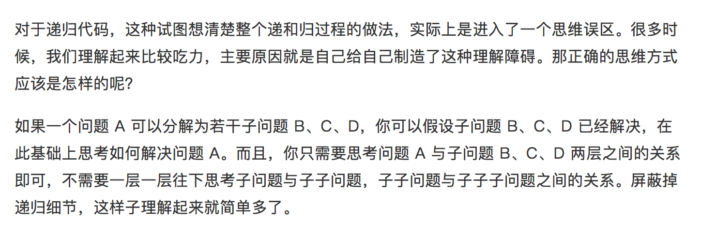

可以用递归来解决的问题需要满足三个条件
1. 一个问题可以分解为几个子问题的解
2. 这个问题与分解后的问题，除了数据规模不同，求解思路完全一样
3. 存在递归终止条件

> 编写递归代码的关键是，只要遇到递归，我们就把它抽象成一个递推公式，不用想一层层的调用关系，不用试图用人脑去分解递归的每一个步骤




```Python
# 链表和
def sum_linklist(node):
    if not node:
        return 0
    return node.value + sum_linklist(node.next)
```

```Python
#汉诺塔问题
count = 0

def move(x,y):
    global count 
    print("{} -> {}".format(x,y))
    count += 1

def Hanoi(num,a,b,c):
    if num == 1:
        move(a,b)
    else:
        Hanoi(num-1,a,c,b)
        move(a,b)
        Hanoi(num-1,c,b,a)


Hanoi(20,"a","b","c")
print(count)
```

## 尾递归
对于递归函数的使用，人们所关心的一个问题是栈空间的增长。确实，随着被调用次数的增加，某些种类的递归函数会线性地增加栈空间的使用 —— 不过，有一类函数，即尾部递归函数，不管递归有多深，栈的大小都保持不变。尾递归属于线性递归，更准确的说是线性递归的子集。
　
函数所做的最后一件事情是一个函数调用（递归的或者非递归的），这被称为尾部调用（tail-call）。使用尾部调用的递归称为 尾部递归。当编译器检测到一个函数调用是尾递归的时候，它就覆盖当前的活动记录而不是在栈中去创建一个新的。编译器可以做到这点，因为递归调用是当前活跃期内最后一条待执行的语句，于是当这个调用返回时栈帧中并没有其他事情可做，因此也就没有保存栈帧的必要了。通过覆盖当前的栈帧而不是在其之上重新添加一个，这样所使用的栈空间就大大缩减了，这使得实际的运行效率会变得更高。
　　
```Python
def factorial(n):
    if n == 1:
        return 1
    else:
        return n * factorial(n-1)


def factorial_tail(total,n):
    if n == 1:
        return total
    else:
        return factorial_tail(total * n,n-1)


print(factorial_tail(1,4))
```
上面代码是一个阶乘函数，计算n的阶乘，最多需要保存n个调用记录，复杂度 O(n).
如果改写成尾递归，只保留一个调用记录，复杂度 O(1).
[递归.pdf](resources/EEAE76645ECEDFF9CF48517199599113.pdf)