## 如何分析一个“排序算法”？
1. 算法的执行效率
    1. 最好、最坏、平均情况时间复杂度。
    2. 时间复杂度的系数、常数和低阶。
    3. 比较次数，交换（或移动）次数。
2. 排序算法的稳定性
    1. 稳定性概念：如果待排序的序列中存在值相等的元素，经过排序之后，相等元素之间原有的先后顺序不变。
    2. 稳定性重要性：可针对对象的多种属性进行有优先级的排序。
    3. 举例：给电商交易系统中的“订单”排序，按照金额大小对订单数据排序，对于相同金额的订单以下单时间早晚排序。用稳定排序算法可简洁地解决。先按照下单时间给订单排序，排序完成后用稳定排序算法按照订单金额重新排序。
3. 排序算法的内存损耗
    1. 原地排序算法：特指空间复杂度是O(1)的排序算法。

## 冒泡排序(Bubble Sort)
> 冒泡排序只会操作相邻的两个数据。每次冒泡操作都会对相邻的两个元素进行比较，看是否满足大小关系要求。如果不满足就让她俩互换。一次冒泡会让至少一个元素移动到它应该在的位置，重复n次，就完成了 n 个数据的排序工作。

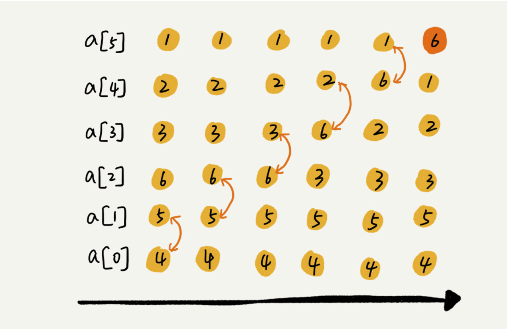
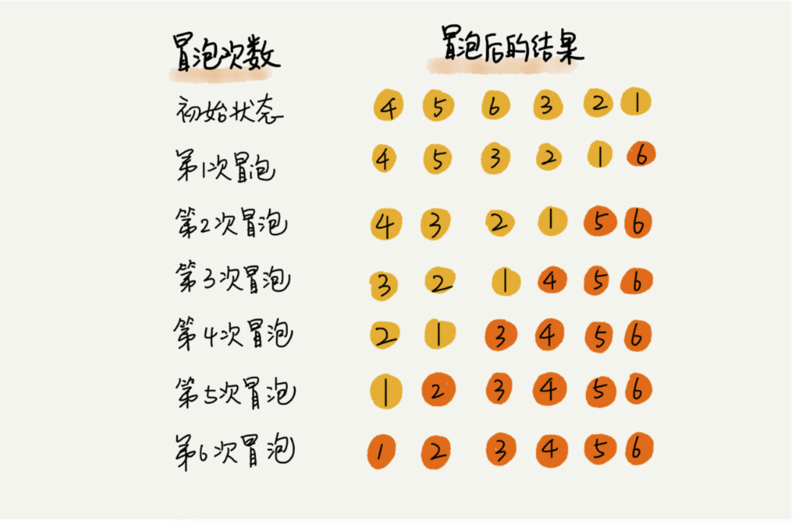

实际上，当在某次冒泡过程中，已经没有元素相互交换，就说明数据已经有序了。

- 冒泡是原地排序算法
- 冒泡是稳定排序算法（当比较两个元素时，出现相等的情况就不交换彼此）
- 时间复杂度
    - 最好的情况下(数据已经有序),只需要进行一次冒泡操作,复杂度为O(n)
    - 最坏的情况下,元素是倒排的,此时需要进行n次冒泡操作,复杂度为O(n^2)
    - 平均复杂度:
    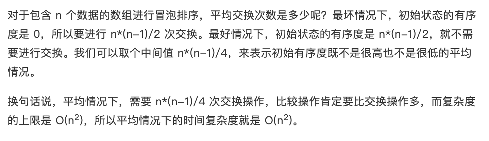
- code
    ```Python
    def bubble_sort(lists):
        for i in range(len(lists)):
            flag = True
            for j in range(len(lists)-i-1):
                if lists[j] > lists[j+1]:
                    lists[j],lists[j+1] = lists[j+1], lists[j]
                    flag = False
            if flag:
                break
    ```

## 插入排序（InsertionSort）

> 插入排序是一种简单直观的排序算法。它的工作原理是通过构建有序序列，对于未排序数据，在已排序序列中从后向前扫描，找到相应位置并插入。插入排序在实现上，在从后向前扫描过程中，需要反复把已排序元素逐步向后挪位，为最新元素提供插入空间。

插入排序也包含两种操作，一种是元素比较，一种是元素移动。当我们需要移动元素a时，我们需要拿a与排序好的区间里的元素依次比较，在比较的过程中，把排序好的元素移位，方便为a 元素的最终位置腾出空间。

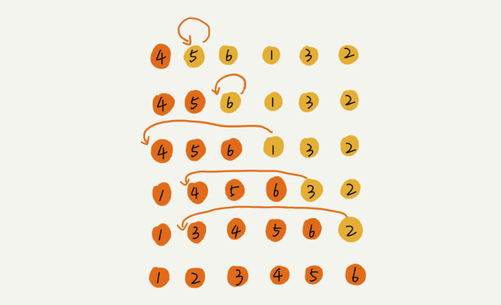
- code
    ```Python
    def insert_sort(lists):
        for i in range(1,len(lists)):
            tmp = lists[i]
            for j in range(i-1,-1,-1):
                if lists[j] > tmp:
                    lists[j+1] = lists[j] #数据移动
                else:
                    break
            lists[j] = tmp    
    ```

- 插入排序是原地排序
- 插入排序是稳定的排序算法
- 时间复杂度
    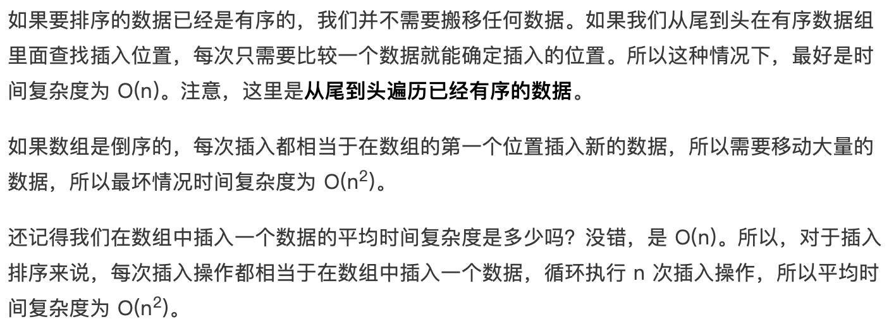

## 直接选择排序
> 同样分为已排序的区间和未排序的区间。但是选择排序每次会从未排序的区间中找到最小的元素，将其放到已排序区间的末尾。

基本思想：第1趟，在待排序记录r1 ~ r[n]中选出最小的记录，将它与r1交换；第2趟，在待排序记录r2 ~ r[n]中选出最小的记录，将它与r2交换；以此类推，第i趟在待排序记录r[i] ~ r[n]中选出最小的记录，将它与r[i]交换，使有序序列不断增长直到全部排序完毕。
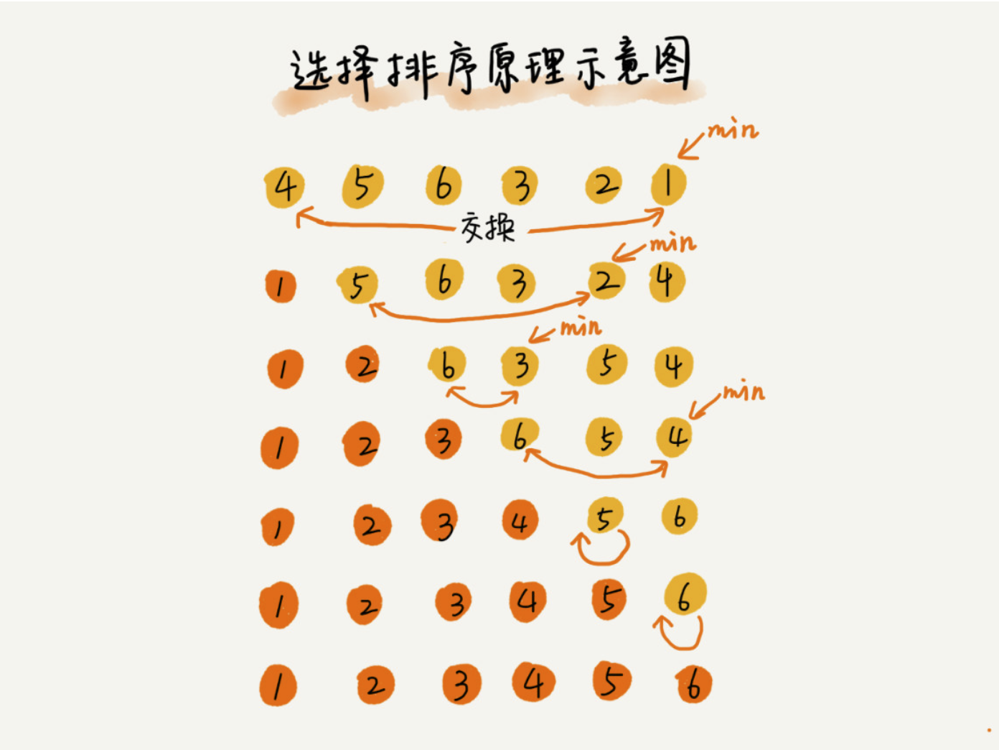

- 是原地排序
- 不是稳定排序
  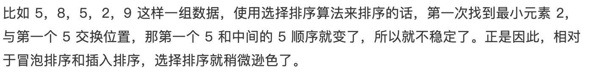
- 最好情况下时间复杂度为O(n),最坏为O(n^2),平均情况下为O(n^2)

```Python
def select_sort(lists):
    for i in range(0,len(lists)):
        cur_min = i
        for j in range(i, len(lists)):
            if lists[j] < lists[cur_min]:
                cur_min = j
        lists[i],lists[cur_min] = lists[cur_min],lists[i]
```

## 三种 O(n^2)时间复杂度的算法比较，适合小规模数据
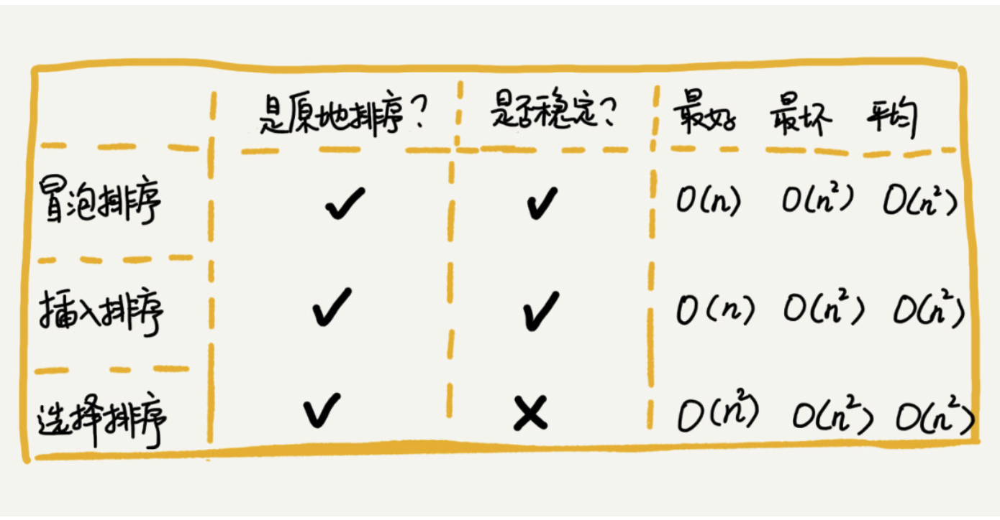


## 归并排序
> 如果要排序一个数组，我们先把数组从中间分成两部分，然后对前后两部分分别进行排序，再将排序好的两部分结合在一起，这样整个数组就有序了。

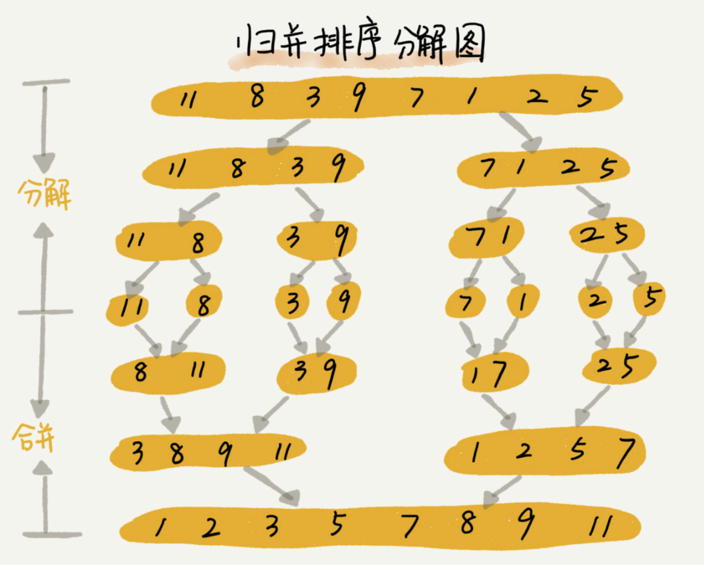
**归并排序使用了分治思想，分治是一种解决问题的处理思想，递归是一种手段，分治常常利用递归来实现**

- 递推公式
    ```Python
    #递推公式：
    merge_sort(p…r) = merge(merge_sort(p…q), merge_sort(q+1…r))
    #终止条件：
    p >= r 不用再继续分解
    ```
- code
    ```Python
    def merge(left,right):
        i,j = 0,0
        result = []
        while i < len(left) and j < len(right):
            if left[i] <= right[j]:
                result.append(left[i])
                i += 1
            else:
                result.append(right[j])
                j += 1
    
        result += left[i:]
        result += right[j:]
        
        return result
    
    
    
    def merge_sort(lists):
        # 递归终止条件 -> 不可再分
        if len(lists) <= 1:
            return lists
    
        num = len(lists)//2
    
        left = merge_sort(lists[:num])
        right = merge_sort(lists[num:])
        
        return merge(left,right) 
    ```
- 归并排序不是就地排序算法
- 归并排序是稳定排序算法
    在merge函数中，如果 left 和 right 中有值相同的元素，可以先把 left中的元素放入 result，这样保持了元素的有序性。
- 时间复杂度分析
    $$T(a) = T(b) + T(c) + K$$
    ```math
    T(1) = C；   n=1 时，只需要常量级的执行时间，所以表示为 C。
    T(n) = 2*T(n/2) + n； n>1
   
    T(n) = 2*T(n/2) + n
     = 2*(2*T(n/4) + n/2) + n = 4*T(n/4) + 2*n
     = 4*(2*T(n/8) + n/4) + 2*n = 8*T(n/8) + 3*n
     = 8*(2*T(n/16) + n/8) + 3*n = 16*T(n/16) + 4*n
     ......
     = 2^k * T(n/2^k) + k * n
     ......
     ```
     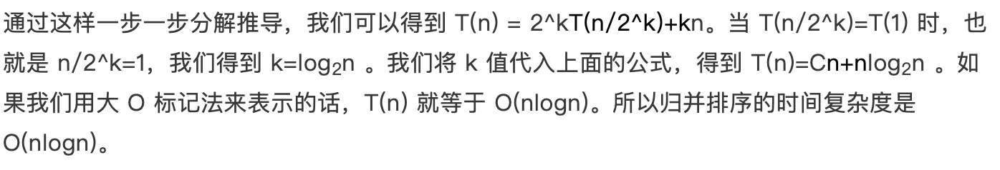
- 空间复杂度分析
    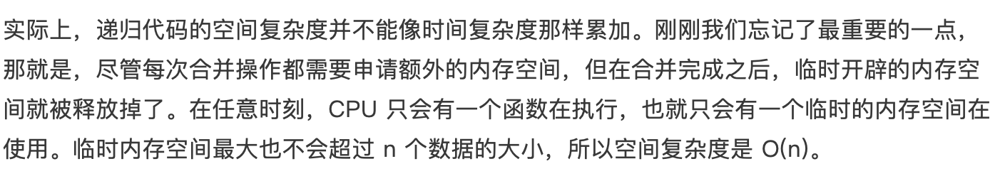

## 快速排序(Quick Sort)
> 快速排序也是利用分治的思想，如果要排序数组中从下标q,r之间的数据，我们从q,r之间选择一个数据作为pivot，小于 pivot 的数据放左边，大于pivot的数据放右边，中间是pivot。

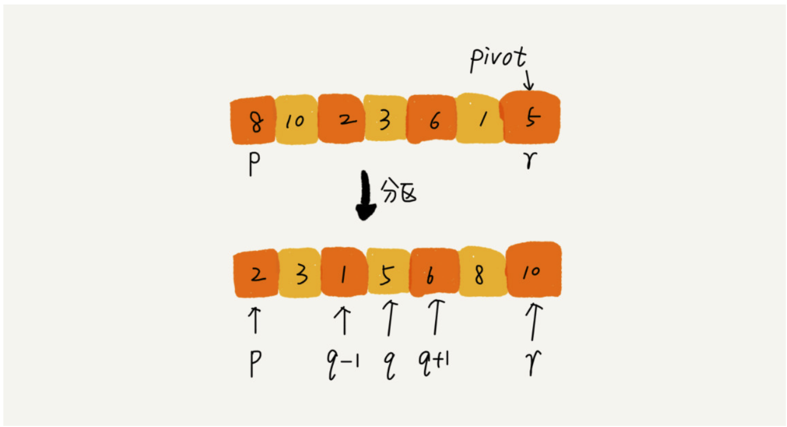
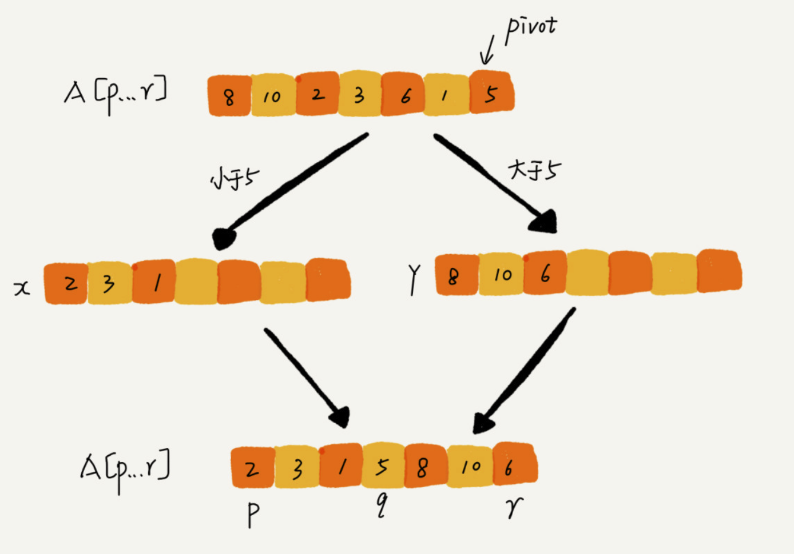


- 地推公式(快速实现)
    ```math
    递推公式：
    quick_sort(lists) = quick_sort([item < pivot]) + pivot +  quick_sort(item > pivot)
    
    终止条件：
    len(lists) <= 1
    ```
- code
    ```Python
    # 快速实现
    from random import choice    
    def quick_sort(lists):
        if len(lists) <= 1:
            return lists
        else:
            pivot = choice(lists)
            return quick_sort([item for item in lists if item < pivot]) + [pivot] + quick_sort([item for item in lists if item > pivot])    
    ```
- 就地排序版本
    ```math
    partition(A, p, r) {
      pivot := A[r]
      i := p
      for j := p to r-1 do {
        if A[j] < pivot {
          swap A[i] with A[j]
          i := i+1
        }
      }
      swap A[i] with A[r]
      return i
    ```
    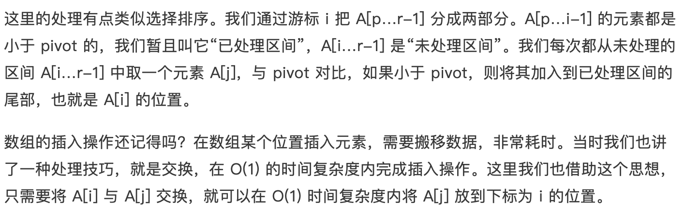
    
    
- 地推公式(就地排序)
    ```math
    递推公式：
    quick_sort(p…r) = quick_sort(p…q-1) + quick_sort(q+1, r)

    终止条件：
    p >= r
    
    // 快速排序，A 是数组，n 表示数组的大小
    quick_sort(A, n) {
      quick_sort_c(A, 0, n-1)
    }
    // 快速排序递归函数，p,r 为下标
    quick_sort_c(A, p, r) {
      if p >= r then return
      
      q = partition(A, p, r) // 获取分区点
      quick_sort_c(A, p, q-1)
      quick_sort_c(A, q+1, r)
    }
    ```
- code
    ```Python
    from random import randint
    ## 就地排序实现
    def randomized_partition(lists,left,right):
        
        # 生成随机元素并与 lists 最右边元素进行交换
        pivot = randint(left,right)
        lists[pivot],lists[right] = lists[right],lists[pivot]
        
        i = left
        # 0..i保存着比 pivot 小的所有元素
        for j in range(left,right):
            if lists[j] < lists[right]:
                lists[i],lists[j] = lists[j],lists[i]
                i += 1
        lists[right],lists[i] = lists[i],lists[right]
    
        return i 
    
    def quick_sort_c(lists, left, right):
        if left >= right:
            return 
        pivot = randomized_partition(lists,left, right)
        quick_sort_c(lists,left,pivot)
        quick_sort_c(lists,pivot+1,right)
            
    
    
    def quick_sort(lists):
        if len(lists) <= 1:
            return 
        quick_sort_c(lists,0,len(lists)-1)
    ```
- 快速排序是就地排序算法
- 快速排序是不稳定算法
    - 待排序数组:int a[] ={1, 2, 2, 3, 4, 5, 6},在快速排序的随机选择pivot阶段：
    - 若选择a[2]（即数组中的第二个2）为pivot，而把大于等于比较子的数均放置在大数数组中，则a[1]（即数组中的第一个2）会到pivot的右边， 那么数组中的两个2非原序（这就是“不稳定”）。
    - 若选择a[1]为pivot，而把小于等于比较子的数均放置在小数数组中，则数组中的两个2顺序也非原序
- 时间性能分析
    - 地推公式
        ```math
        T(1) = C；   n=1 时，只需要常量级的执行时间，所以表示为 C。
        T(n) = 2*T(n/2) + n； n>1
        ```
    - 大部分情况下的时间复杂度都可以做到 O(nlogn)，只有在极端情况下才退化为O(n^2)

## 归并和快排比较
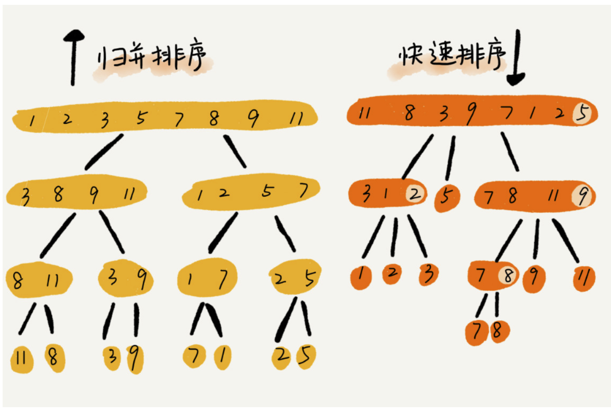


## 桶排序(Buckle Sort)
> 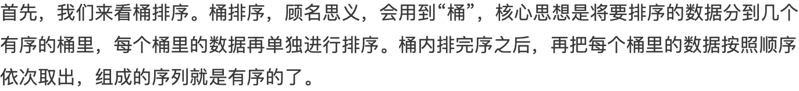

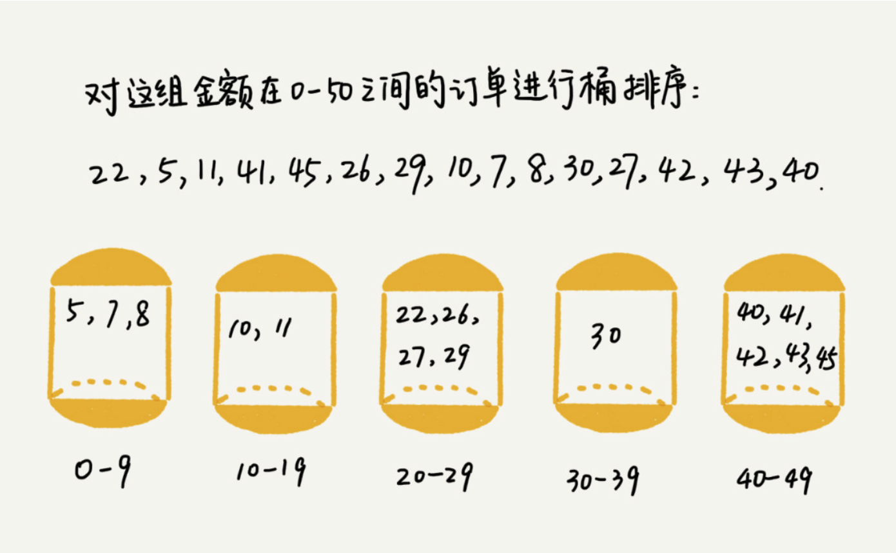

- 时间复杂度：
    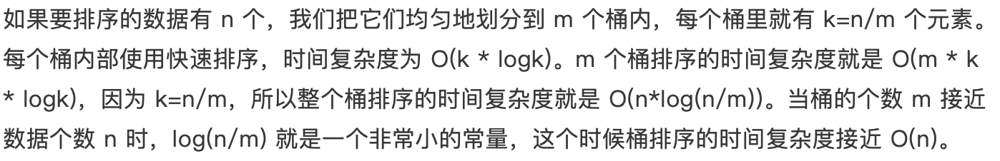
- 什么时候适合桶排序？
    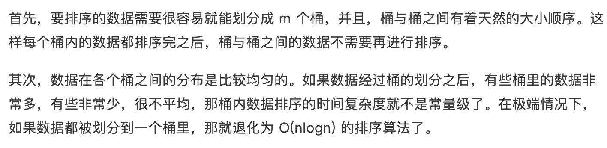
    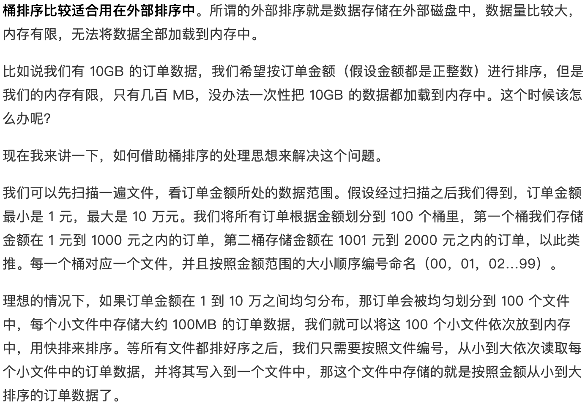
    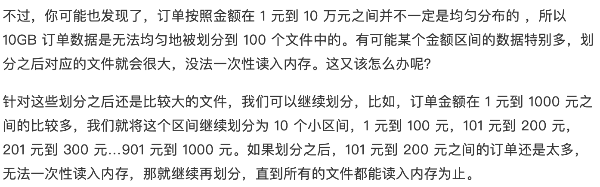

## 计数排序(Counting Sort)
> 当要排序的数据n量很大，而数据规模k很小时，可以采用计数排序，按照数据规模k创建k个桶，这样只要扫描一遍数据，把相应的数据放入桶中就实现了排序

- example:
    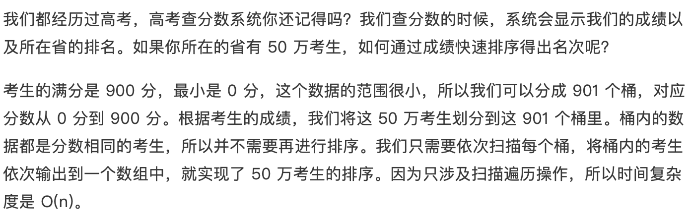
    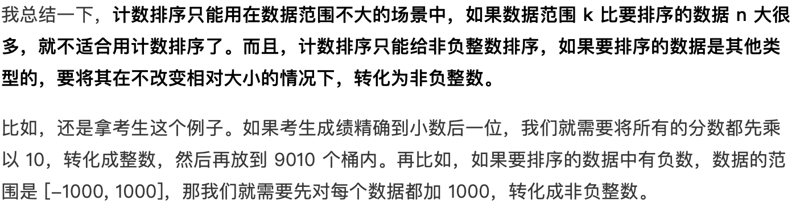

## 基数排序(radix sort)
> 是一种非比较型整数排序算法，其原理是将整数按位数切割成不同的数字，然后按每个位数分别比较。由于整数也可以表达字符串（比如名字或日期）和特定格式的浮点数，所以基数排序也不是只能使用于整数.
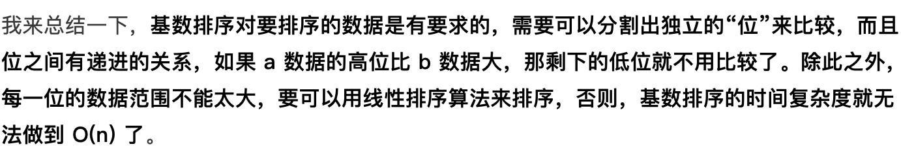

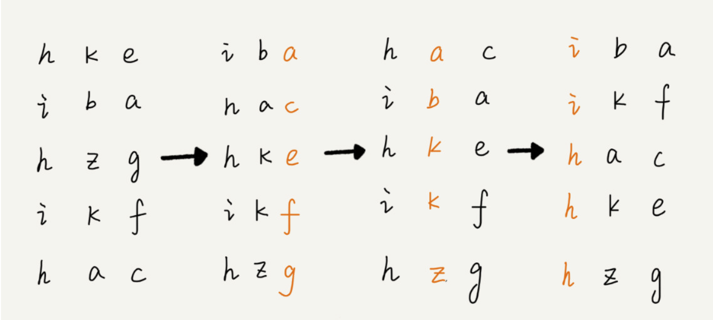

- example
    
- 时间复杂度:
    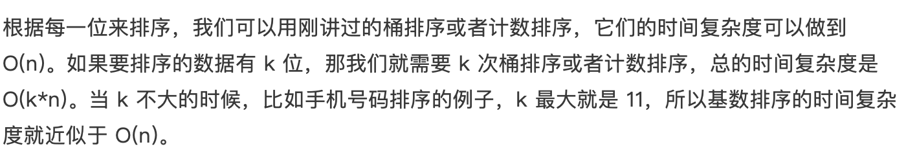
- code
    ```Python
    ## 基数排序
    import math
    from functools import reduce
    from operator import add
    def radix_sort(lists, radix = 11):
        for i in range(radix):
            buckets = [[] for i in range(radix)]
            for j in lists:
                ## 放入桶 i 中
                buckets[j//(10**i)%10].append(j)
            lists = reduce(add,buckets)
            del buckets
        return lists
    ```