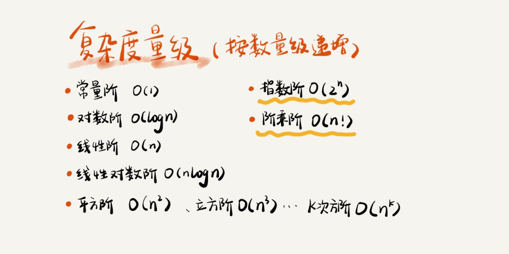
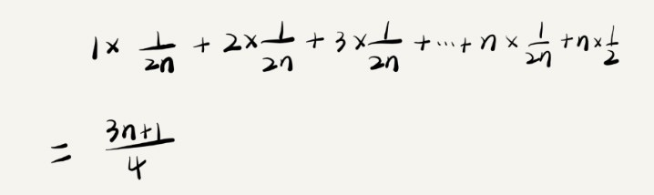

**数据结构指的是“一组数据的存储结构”，算法指的是“操作数据的一组方法”**
**数据结构是为算法服务的，算法是要作用再特定的数据结构上的**

### 学什么：
1. 效率和资源消耗的度量衡--复杂度分析。
2. 最常用、最基础的20个数据结构与算法，学习他们的：“来历”、“特点”、“适合解决什么问题”和“实际的应用场景”。
数据结构：数组、链表、栈、队列、散列表、二叉树‘、堆、跳表、图、Tire树
算法： 递归、排序、二分查找、搜索、哈希算法、贪心算法、分治算法、回溯算法、动态规划、字符串匹配算法

### 怎么学
1. 边学边练。

## 复杂度分析上
如何来衡量写的算法代码的执行效率？ 我们需要一个不用具体的测试数据就可以粗略地估计算法的执行效率的方法
> 复杂度分析是整个算法学习的精髓

$$T(n) = O(f(n))$$

f(n)表示每行代码执行的次数总和 
O表示成正比

```c
int cal(int n){
    int sum = 0;
    int i = 1;
    for(;i<=n;++i){
        sum = sum + i
    }
    return sum
}
```

> T(n) = (2*n+3)* unit_time

## 时间复杂度
### 大 O 表示法的准确意义
> 表示代码执行时间随数据规模增长的变化趋势

### 时间复杂度分析方法
1. 只关注执行循环次数最多的那一段代码
2. 加法法则，复杂度等于量级最大的那段代码的复杂度
如果 T1(n)=O(f(n))，T2(n)=O(g(n))；那么 T(n)=T1(n)+T2(n)=max(O(f(n)), O(g(n))) =O(max(f(n), g(n))).
3. 乘法法则，嵌套代码的复杂度等于嵌套内外复杂度的乘积
如果 T1(n)=O(f(n))，T2(n)=O(g(n))；那么 T(n)=T1(n)*T2(n)=O(f(n))*O(g(n))=O(f(n)*g(n)).

### 常见复杂度实例分析


对于罗列的复杂度量级，我们可以粗略地分为两类
1. 多项式量级
2. 非多项式量级。

其中，非多项式量级只有两个：O(2n) 和 O(n!)。我们把时间复杂度为非多项式量级的算法问题叫作NP（Non-Deterministic Polynomial，非确定多项式）问题。

1. O(1)
```C
int i = 8;
int j = 6;
int sum = i + j;
```

2. O(logn)
```C
i=1;
while (i <= n)  {
  i = i * 2;
}
```
我们知道，对数之间是可以互相转换的，log3n 就等于 log32 * log2n，所以 O(log3n) = O(C * log2n)，其中 C=log32 是一个常量。基于我们前面的一个理论：在采用大 O 标记复杂度的时候，可以忽略系数，即 O(Cf(n)) = O(f(n))。所以，O(log2n) 就等于 O(log3n)。因此，在对数阶时间复杂度的表示方法里，我们忽略对数的“底”，统一表示为 O(logn)

3.O(m+n)
```C
int cal(int m, int n) {
  int sum_1 = 0;
  int i = 1;
  for (; i < m; ++i) {
    sum_1 = sum_1 + i;
  }
 
  int sum_2 = 0;
  int j = 1;
  for (; j < n; ++j) {
    sum_2 = sum_2 + j;
  }
 
  return sum_1 + sum_2;
}
```
从代码中可以看出，m 和 n 是表示两个数据规模。我们无法事先评估 m 和 n 谁的量级大，所以我们在表示复杂度的时候，就不能简单地利用加法法则，省略掉其中一个。所以，上面代码的时间复杂度就是 O(m+n)。

## 空间复杂度
时间复杂度的全称是渐进时间复杂度，表示算法的执行时间与数据规模之间的增长关系。类比一下，空间复杂度全称就是渐进空间复杂度（asymptotic space complexity），表示算法的存储空间与数据规模之间的增长关系。
```C
void print(int n) {
 int i = 0;
 int[] a = new int[n];
 for (i; i <n; ++i) {
   a[i] = i * i;
 }
 
 for (i = n-1; i >= 0; --i) {
   print out a[i]
 }
}
```
我们常见的空间复杂度就是 O(1)、O(n)、O(n2 )，像 O(logn)、O(nlogn) 这样的对数阶复杂度平时都用不到。而且，空间复杂度分析比时间复杂度分析要简单很多。

## 复杂度分析下
### 最好、最坏情况时间复杂度
```C
int find(int[] array, int n, int x) {
  int i = 0;
  int pos = -1;
  for (; i < n; ++i) {
    if (array[i] == x) {
       pos = i;
       break;
    }
  }
  return pos;
}
```
如果数组中第一个元素正好是要查找的变量 x，那就不需要继续遍历剩下的 n-1 个数据了，那时间复杂度就是 O(1)。但如果数组中不存在变量 x，那我们就需要把整个数组都遍历一遍，时间复杂度就成了 O(n)

1. 最好情况时间复杂度就是，在最理想的情况下，执行这段代码的时间复杂度
2. 最坏情况时间复杂度就是，在最糟糕的情况下，执行这段代码的时间复杂度

### 平均情况时间复杂度
要查找的变量 x 在数组中的位置，有 n+1 种情况：在数组的 0～n-1 位置中和不在数组中。我们把每种情况下，查找需要遍历的元素个数累加起来，然后再除以 n+1，就可以得到需要遍历的元素个数的平均值

### 加权平均情况时间复杂度
我们知道，要查找的变量 x，要么在数组里，要么就不在数组里。这两种情况对应的概率统计起来很麻烦，为了方便你理解，我们假设在数组中与不在数组中的概率都为 1/2。另外，要查找的数据出现在 0～n-1 这 n 个位置的概率也是一样的，为 1/n。所以，根据概率乘法法则，要查找的数据出现在 0～n-1 中任意位置的概率就是 1/(2n)。


### 均摊时间复杂度
```C
 // array 表示一个长度为 n 的数组
 // 代码中的 array.length 就等于 n
 int[] array = new int[n];
 int count = 0;
 
 void insert(int val) {
    if (count == array.length) {
       int sum = 0;
       for (int i = 0; i < array.length; ++i) {
          sum = sum + array[i];
       }
       array[0] = sum;
       count = 1;
    }
 
    array[count] = val;
    ++count;
 }
```
最理想的情况下，数组中有空闲空间，我们只需要将数据插入到数组下标为 count 的位置就可以了，所以最好情况时间复杂度为 O(1)。最坏的情况下，数组中没有空闲空间了，我们需要先做一次数组的遍历求和，然后再将数据插入，所以最坏情况时间复杂度为 O(n)。

#### 摊还分析法
我们还是继续看在数组中插入数据的这个例子。每一次 O(n) 的插入操作，都会跟着 n-1 次 O(1) 的插入操作，所以把耗时多的那次操作均摊到接下来的 n-1 次耗时少的操作上，均摊下来，这一组连续的操作的均摊时间复杂度就是 O(1)。
> 均摊时间复杂度就是一种特殊的平均时间复杂度