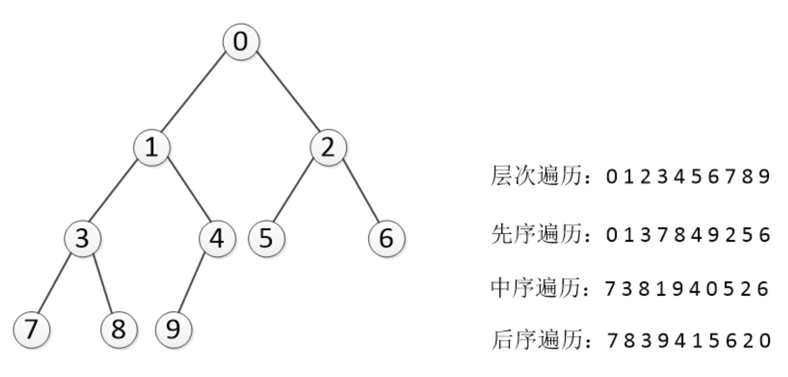

##递归
```Python
def recursive_preorder(self,node):
    """
    递归先序遍历
    """
    if not node:
        return
    else:
        print(node.elem, end = ", ")  
        self.recursive_preorder(node.left)  
        self.recursive_preorder(node.right)

    
def recursive_inorder(self,node):
    """
    中序遍历
    """        
    if not node:
        return 
    else:
        self.recursive_inorder(node.left)
        print(node.elem,end = ", ")
        self.recursive_inorder(node.right)

def recursive_postorder(self,node):
    """
    后续遍历
    """
    if not node:
        return 
    else:
        self.recursive_postorder(node.left)
        self.recursive_postorder(node.right)
        print(node.elem,end = ", ")
```

## 非递归

### 非递归前序遍历
对于任一结点P：

1. 先把根结点放到一个栈S中。
2. 当S不为空时，就从栈顶pop一个结点，然后分别将它的右孩子，左孩子先后push到栈S里。如果子结点为空，什么也不做。
3. 重复第2步，直到栈S为空。

法2:
1. 访问结点P，并将结点P入栈;
2. 判断结点P的左孩子是否为空，若为空，则取栈顶结点并进行出栈操作，并将栈顶结点的右孩子置为当前的结点P，循环至1);若不为空，则将P的左孩子置为当前的结点P;
3. 直到P为NULL并且栈为空，则遍历结束。


```Python
def non_recursive_preorder(self,node):
    """
    非递归前序遍历
    """
    if not node:
        return 

    stack = deque()
    stack.append(node)
    while stack:
        curr_node = stack.pop()
        if not curr_node:
            continue
        print(curr_node,end = " ")    
        stack.append(curr_node.right)
        stack.append(curr_node.left)
        
def non_recursive_preorder2(self,node):
        """
        非递归前序遍历2
        """
        stack = deque()
        while stack or node:
            while node:
                print(node,end = " ")
                stack.append(node)
                node = node.left
            #当左子树为空，当前结点出栈，当前结点为出栈的元素    
            node = stack.pop()
            #当前结点改为当前结点的右子树
            node = node.right
```

### 非递归中序遍历
与非递归前序遍历类似，不同之处在于出栈后再打印元素
```
def non_recursive_inorder(self,node):
    """
    非递归中序遍历
    """
    stack = deque()
    while stack or node:
        while node:
            stack.append(node)
            node = node.left
        #当左子树为空，当前结点出栈，当前结点为出栈的元素    
        node = stack.pop()
        print(node,end = " ")
        #当前结点改为当前结点的右子树
        node = node.right
```

### 非递归后序遍历
先沿左子树向下搜索，并做入栈操作，当到达最左端时。取栈顶元素（非出栈）进行判断，若其右孩子不为空并且未被访问，则将其右孩子圧入栈中，沿其右孩子左子树继续向下搜索。当右孩子为空或者已经被访问，此时具有访问的资格了，出栈访问，并且做好记录，方便下次判断。
```Python
def non_recursive_postorder(self,node):
        stack = deque()
        last_visit = None
        index = 0
        while len(stack) or node:
            while node:
                stack.append(node)
                node = node.left
            if len(stack) != 0:
                node = stack[-1]
                if not node.right or node.right ==  last_visit:
                    last_visit = stack.pop()
                    print(last_visit, end = " ")
                    node = None
                else:
                    node = node.right
```


### 层次遍历
用队列实现，每次出对后打印当前节点，然后把当前节点的左右孩子结点入队
```Python
    def recursive_level_traversal(self, node):
        """
        层次遍历
        """
        queue = deque()
        queue.append(node)
        while queue:
            curr_node = queue.popleft()
            print(curr_node,end = " ")
            if curr_node.left:
                queue.append(curr_node.left)
            if curr_node.right:
                queue.append(curr_node.right)
```