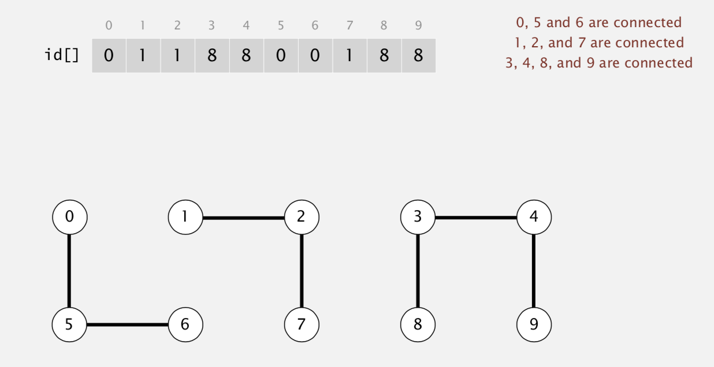
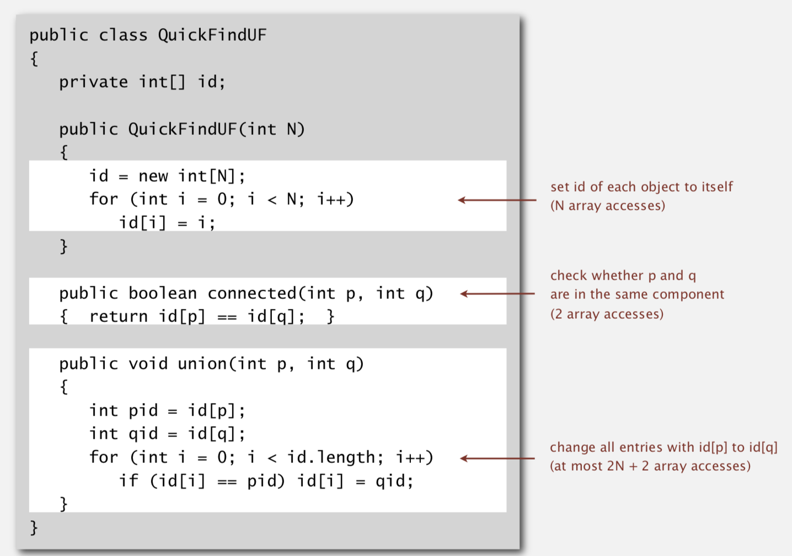
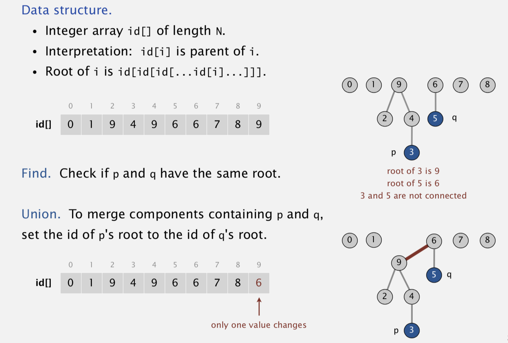
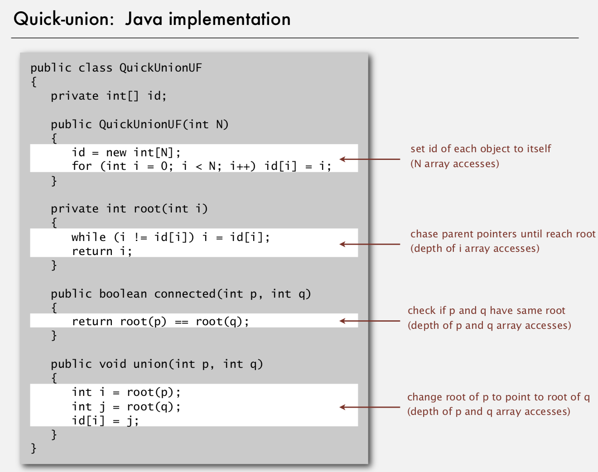
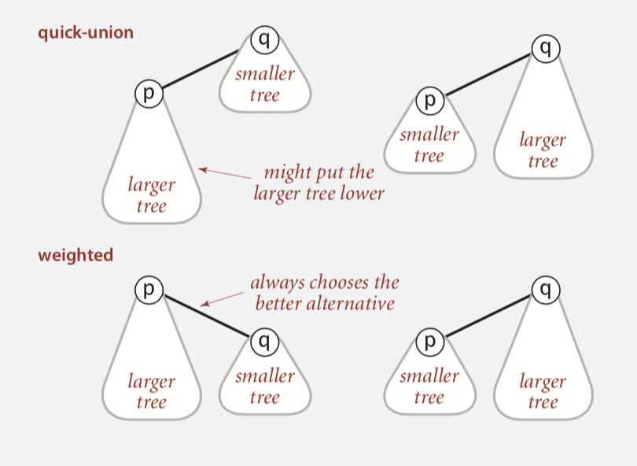
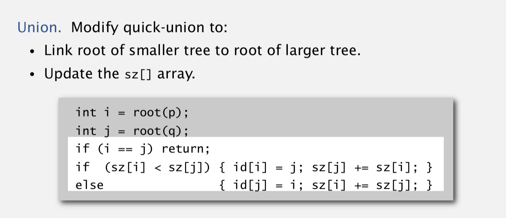
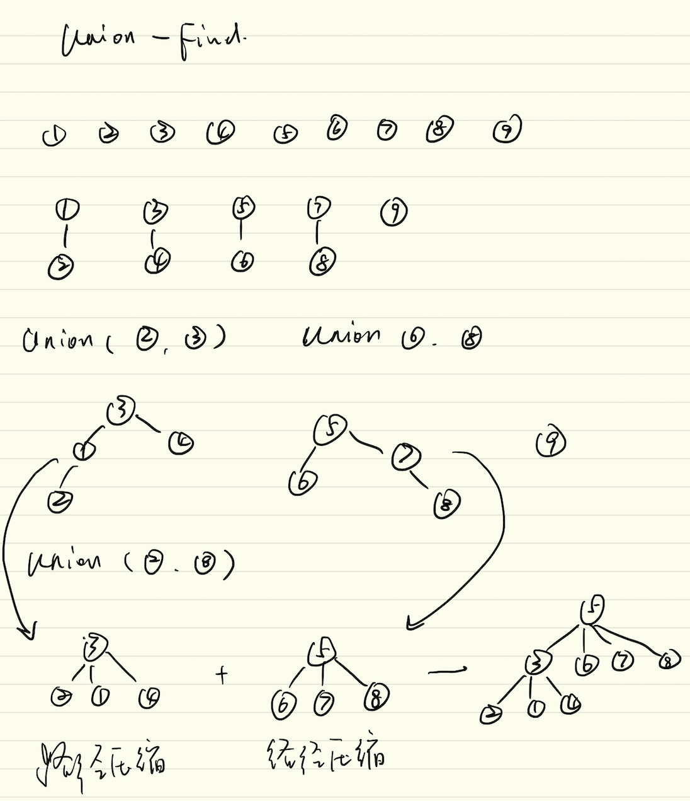

## Steps to developing a usable algorithm. 

1. Model the problem.
2. Find an algorithm to solve it. 
3. Fast enough? 
4. Fits in memory?
5. If not, figure out why.
6. Find a way to address the problem.
7. Iterate until satisfied.

## Implementing the operations
- **Find query.** Check if two objects are in the same component. 

- **Union command.** Replace components containing two objects with their union.

## Quick Find

- 连接两个 node 时，要把和这两个 node 具有相同 id 的所有 node 设置为同样的 id
- Union is too expensive. It takes $N^2$ array accesses to process a sequence of N union commands on N objects.

## Quick Union

- 连接两个 node 时，将两个 node 的root 连接在一起
- Trees can get tall.
- Find too expensive (could be N array accesses).

## Union Find

### Improvement 1: weighting

1. Modify quick-union to avoid tall trees.
2.  Keep track of size of each tree (number of objects).
3.  Balance by linking root of smaller tree to root of larger tree.

### Improvement 2: path compression
1. Quick union with path compression. Just after computing the root of p, set the id of each examined node to point to that root.

