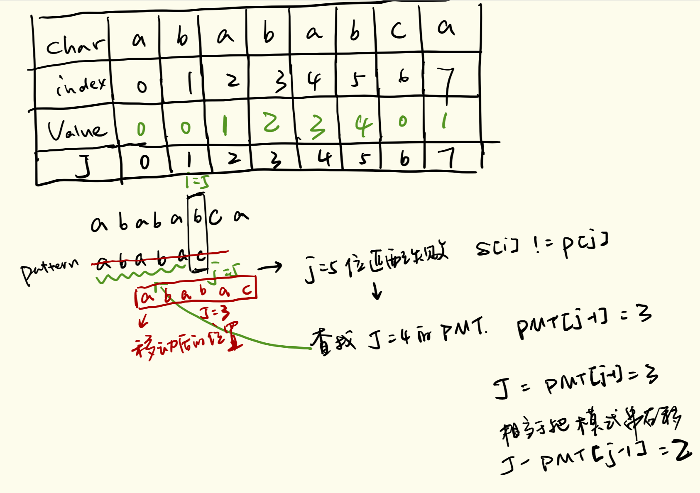

## 前缀与后缀

- abbaab 的头部有 a, ab, abb, abba, abbaa（不包含最后一个字符。下文称之为「前缀」）
- abbaab 的尾部有 b, ab, aab, baab, bbaab（不包含第一个字符。下文称之为「后缀」）

最长公共前缀后缀是ab,乙由当前位置回退两格.

## Partial Match Table 部分匹配表
- pattern 自身的性质
- 假设匹配到 pattern 的每一个位置, 则针对该部分的公共前缀后缀的长度可以做成一张表。如 abababca, 有:


## 利用 PMT 查找下一个位置
- 如图所示，要在主字符串"ababababca"中查找模式字符串"abababca"。如果在 j 处字符不匹配，那么由于前边所说的模式字符串 PMT 的性质，主字符串中 i 指针之前的 PMT[j −1] 位就一定与模式字符串的第 0 位至第 PMT[j−1] 位是相同的。


- 们看到如果是在 j 位 失配，那么影响 j 指针回溯的位置的其实是第 j −1 位的 PMT 值.所以为了编程的方便，我们不直接使用PMT数组，而是将PMT数组向后偏移一位.换言之，当匹配失败时，模式串向右移动的位数为：失配字符所在位置 - 失配字符对应的next 值，即移动的实际位数为：j - next[j]，且此值大于等于1。

> 失配时，模式串向右移动的位数为：已匹配字符数 - 失配字符的上一位字符所对应的部分匹配表的值（最长公共前后缀）




- 例如，j 指针指向 pattern 中没有匹配的位置，第4位b。此时需要回溯 pattern. 回溯1位，


## 部分匹配表的快速求法
求PMT数组的过程完全可以看成字符串匹配的过程，即以模式字符串为主字符串，以模式字符串的前缀为目标字符串，一旦字符串匹配成功，那么当前的PMT值就是匹配成功的字符串的长度.


```Python
def my_partial(pattern):
    """ Calculate partial match table: String -> [Int]"""
    ret = [0]
    for i in range(1, len(pattern)):
        j = ret[i - 1]
        while j > 0 and pattern[j] != pattern[i]:
            # 如果当前位置不匹配，相当于找到当前位置之前的最大公共前缀后缀，把模式字符串移动 j - ret[ j - 1] 位
            j = ret[j - 1]

        ret.append(j + 1 if pattern[i] == pattern[j] else j)
    return ret

def search(T, P):
    """
    KMP search main algorithm: String -> String -> [Int]
    Return all the matching position of pattern string P in S
    """
    partial, ret, j = my_partial(P), [], 0

    for i in range(len(T)):
        while j > 0 and T[i] != P[j]:
            j = partial[j - 1]

        if T[i] == P[j]:
            j += 1
        if j == len(P):
            ret.append(i - (j - 1))
            j = 0

    return ret
    
```